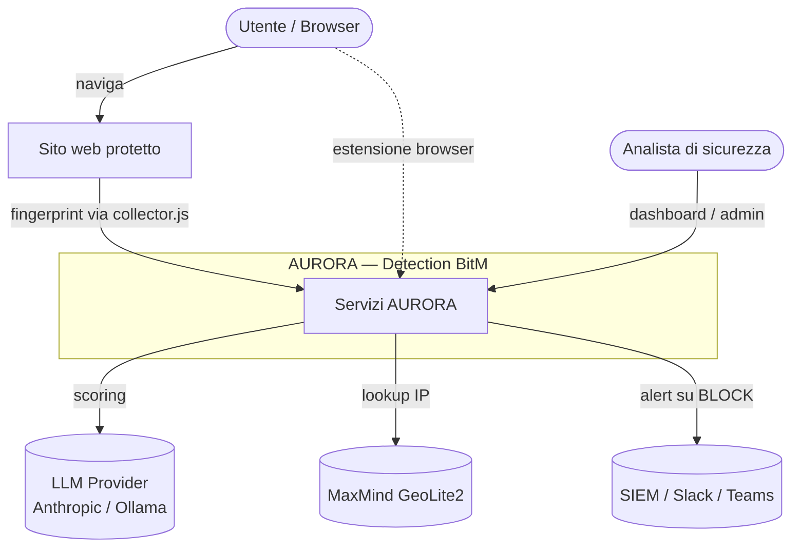
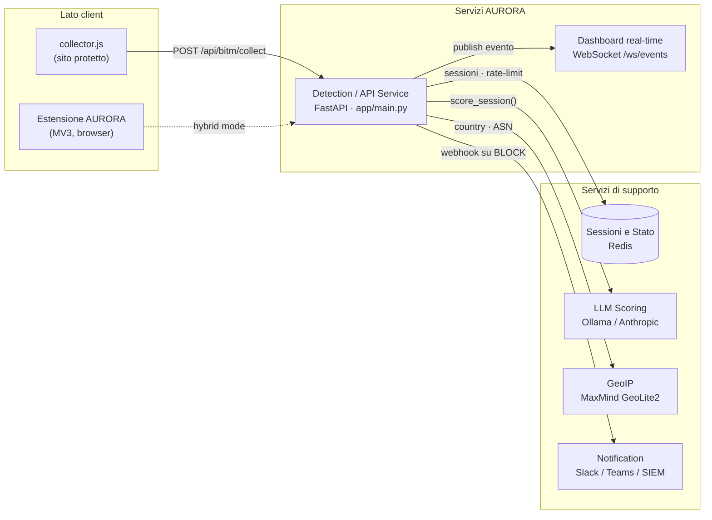
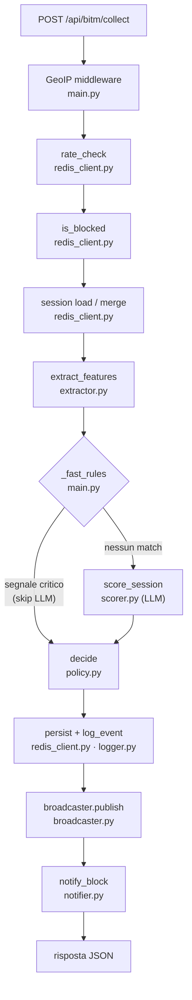
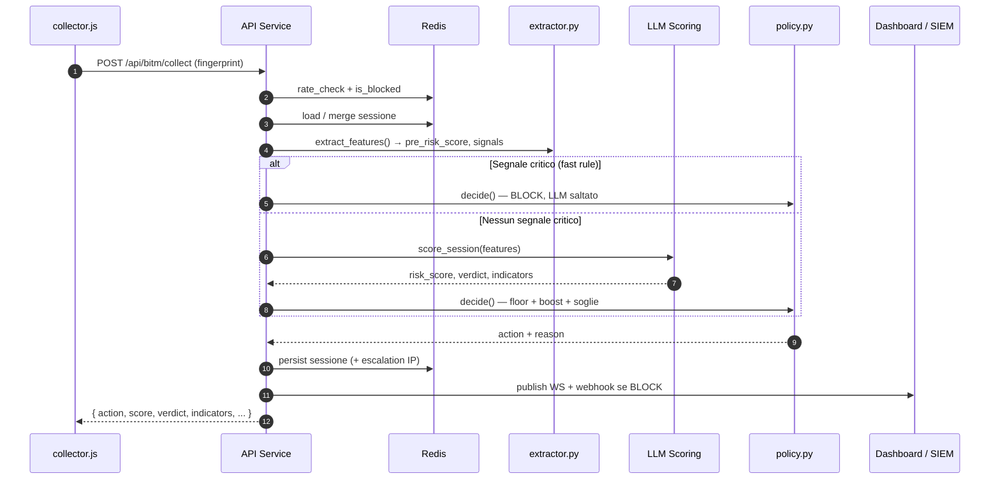

# AURORA

Sistema di rilevamento in tempo reale di attacchi **Browser-in-the-Middle (BitM)**, automazione malevola e bot non autorizzati. Combina fingerprinting comportamentale del browser, regole deterministiche a latenza zero e un motore LLM (Anthropic Claude o Ollama) per classificare ogni richiesta come `allow`, `challenge` o `block`.

> **Versione corrente: 7.4.3** (runtime) · **Estensione browser v0.2.0** (AURORA, MV3)
> Tre modalità di deploy coordinate: (1) backend server-side via `docker compose up` o `python run.py`; (2) integrazione one-liner `<script src="…/collector.js">` su un sito esistente; (3) estensione browser stand-alone (`aurora-extension/`) per la protezione lato utente su qualsiasi sito. Default `LLM_BACKEND=stub` → nessuna API key richiesta per il primo avvio.
>
> 🏛 **Architettura** → [Architettura del sistema](#-architettura-del-sistema): diagrammi di contesto, servizi, componenti e sequenza runtime.
> 📜 **Storico rilasci** → [Changelog](#-changelog) in fondo al documento.

---

## Indice

**Panoramica**
- [Caratteristiche](#-caratteristiche)
- [Architettura del sistema](#-architettura-del-sistema)
- [Come funziona — il flusso di una richiesta](#-come-funziona--il-flusso-di-una-richiesta)

**Uso**
- [Quickstart](#-quickstart)
- [Struttura del progetto](#-struttura-del-progetto)
- [Requisiti](#-requisiti)
- [Installazione & Setup](#-installazione--setup)
- [Avvio](#-avvio)

**Riferimento API**
- [Payload e risposta API](#-payload-e-risposta-api)
- [Endpoints](#-endpoints)

**Modello di detection**
- [Segnali rilevati](#-segnali-rilevati)
- [Soglie e politica decisionale](#-soglie-e-politica-decisionale)
- [Rilevamento BitM / BitM+](#-rilevamento-bitm--bitm)
- [Analisi LLM della traiettoria](#-analisi-llm-della-traiettoria)

**Operazioni**
- [Sicurezza e deployment hardening](#-sicurezza-e-deployment-hardening)
- [GeoIP](#-geoip)
- [Sessioni e Redis](#-sessioni-e-redis)
- [Dashboard real-time](#-dashboard-real-time)
- [Webhook push notifications](#-webhook-push-notifications)
- [Log eventi](#-log-eventi)

**Sviluppo & distribuzione**
- [Test](#-test)
- [E2E Playwright + CI](#-e2e-playwright--ci)
- [Distribuzione Docker + collector.js](#-distribuzione-docker--collectorjs)
- [Fine-tuning LoRA](#-fine-tuning-lora)

**Client**
- [Estensione browser AURORA](#-estensione-browser-aurora)

- [Changelog](#-changelog)

---

## ⚡ Quickstart

Tre percorsi per provare il progetto. Nessuno richiede una API key al primo avvio grazie al backend `stub` deterministico.

### A. Provalo subito con Docker (~30 secondi)

```bash
git clone https://github.com/IntoTheOblivion/AURORA.git && cd AURORA
docker compose up --build
```

Apri `http://localhost:8000/` per la pagina di test e `http://localhost:8000/dashboard` per la dashboard real-time.
Nessuna configurazione necessaria: il servizio parte con `LLM_BACKEND=stub` (scorer deterministico basato su `pre_risk_score` + segnali BitM/BitM+).

Per usare un LLM reale:

```bash
# Anthropic cloud (richiede API key)
LLM_BACKEND=anthropic ANTHROPIC_API_KEY=sk-ant-... docker compose up

# Ollama locale (nessun costo ricorrente) — CPU, funziona ovunque
docker compose --profile ollama up
docker exec -it aurora-ollama ollama pull llama3.1
LLM_BACKEND=ollama docker compose --profile ollama up

# ...oppure con GPU NVIDIA (~10x più veloce, richiede nvidia-container-toolkit / WSL2)
LLM_BACKEND=ollama docker compose --profile ollama-gpu up
```

### B. Integrazione one-liner su un sito esistente

Una volta avviato il backend (locale o remoto), aggiungi questo tag al sito da proteggere:

```html
<script src="https://<host>:8000/collector.js"
        data-endpoint="https://<host>:8000/api/bitm/collect"
        data-auto="true"></script>
```

Il collector raccoglie il fingerprint (UA, plugins, WebGL/canvas, timezone, marker BitM/BitM+) e invia a `/api/bitm/collect` al caricamento della pagina. L'oggetto `window.BitM` espone `BitM.classify()`, `BitM.fingerprint()` e `BitM.onResult(fn)` per integrazioni programmatiche.

### C. Ricercatori e studenti

```bash
docker run --rm -p 8000:8000 ghcr.io/intotheoblivion/aurora:latest
```

Poi apri `http://localhost:8000/` e clicca "Simula attacco BitM" per vedere la pipeline in azione. I paper di riferimento (Tommasi 2021, Tzschoppe 2023, Catalano 2025) sono citati in §[Rilevamento BitM/BitM+](#-rilevamento-bitm--bitm).

### D. Protezione lato utente con l'estensione browser

Se vuoi proteggere **te stesso** mentre navighi su qualsiasi sito (non il tuo), carica l'estensione `aurora-extension/`:

1. `chrome://extensions` (oppure `edge://extensions`)
2. Attiva "Modalità sviluppatore" in alto a destra
3. Clicca "Carica estensione non pacchettizzata" e seleziona la cartella `aurora-extension/`

In modalità `local` (default) l'estensione gira 100% lato client: nessuna connessione al backend, nessun dato inviato in rete. La modalità `hybrid` (opt-in) può invece interrogare il backend per spiegazioni LLM. Vedi §[Estensione browser AURORA](#-estensione-browser-aurora) per il dettaglio.

---

---

## 🚀 Caratteristiche

| Feature | Descrizione |
|---------|-------------|
| **Fast-track deterministico** | Blocca bot noti (HeadlessChrome, Puppeteer, Selenium, Tor) in < 1 ms senza toccare l'LLM |
| **Scoring LLM** | Anthropic Claude o Ollama analizzano il fingerprint completo e restituiscono `risk_score`, `verdict`, `indicators` |
| **Due stadi di score** | `pre_risk_score` deterministico funge da floor: l'LLM non può "scagionare" segnali certi |
| **Soglie contestuali** | Thresholds diversi per `login`, `payment`, `admin`, `static`, `default` |
| **GeoIP automatico** | Country / ASN / ISP via MaxMind GeoLite2; rilevamento VPN su ASN cloud noti |
| **Sessioni persistenti** | Redis con fallback in-memory; multi-step tracking per escalation |
| **IP-block escalation** | Dopo 3 BLOCK consecutivi l'IP entra nel set bloccati permanenti |
| **Rate-limiting** | Sliding window Redis (zset); risponde HTTP 429 oltre soglia |
| **Cache LLM** | Risultati TTL-cached per `(canvas_hash, user_agent[:60])` |
| **Dashboard WebSocket** | Feed live eventi + ring buffer 500 slot + chart + export CSV |
| **Webhook push** | Notifica HTTP POST asincrona verso Slack / Teams / SIEM ad ogni BLOCK |
| **Fine-tuning LoRA** | Pipeline di conversione `aurora_events.jsonl → dataset ChatML` + training LoRA di LLaMA 3.1 |
| **Rilevamento BitM/BitM+** | Firme specifiche per noVNC/WebSockify/TigerVNC (RFB), Apache Guacamole/FreeRDP (RDP), ngrok/Puppeteer/MalSrv/evilGet (BitM+) |

---

## 🏛 Architettura del sistema

AURORA non è un singolo blocco monolitico: è un **insieme di servizi cooperanti** in stile *microservices*, dove ogni capability — **stato di sessione**, **inferenza LLM**, **GeoIP**, **notifica** — è un servizio indipendente e sostituibile (puoi scambiare Anthropic con Ollama, o Redis con il fallback in-memory, senza toccare il resto). Il **Detection Service** (FastAPI) fa da orchestratore e delega a questi servizi dedicati; due collector lato client raccolgono il fingerprint del browser e lo inviano al backend.

| Servizio | Responsabilità | Tecnologia | Dove gira |
|----------|----------------|-----------|-----------|
| **Detection / API Service** | Orchestrazione della pipeline, decisione `allow`/`challenge`/`block` | FastAPI (`app/main.py`) | container `aurora-api` |
| **Session & State Service** | Sessioni multi-step, rate-limit, IP bloccati | Redis (+ fallback in-memory) | container `aurora-redis` |
| **LLM Scoring Service** | Scoring del fingerprint + analisi traiettoria | Ollama / Anthropic | locale o cloud |
| **GeoIP Service** | Country / ASN / VPN a partire dall'IP | MaxMind GeoLite2 | in-process (file `.mmdb`) |
| **Notification Service** | Alert push sugli eventi BLOCK | Webhook → Slack / Teams / SIEM | in-process → endpoint remoto |
| **Dashboard real-time** | Feed eventi live per l'analista | WebSocket + HTML/JS | servita da `aurora-api` |
| **Collector `collector.js`** | Fingerprint lato sito protetto | JS one-liner | nel sito da proteggere |
| **Estensione AURORA** | Detection lato utente su qualunque sito | Chrome MV3 | nel browser dell'utente |

I tre diagrammi seguono il **modello C4**, dal più astratto al più concreto: **contesto** (chi parla con AURORA) → **servizi** (come cooperano) → **componenti** (cosa c'è dentro l'API). Il flusso a runtime è in [Come funziona](#-come-funziona--il-flusso-di-una-richiesta).

### Vista di contesto

Chi usa AURORA e con quali sistemi esterni dialoga.



### I servizi del sistema

Come i servizi cooperano e con quali protocolli. Il Detection Service è l'unico punto d'ingresso: tutto il resto è uno stato, un'inferenza o una notifica delegata.



### Componenti dell'API service

Dentro il Detection Service: i moduli attraversati da ogni richiesta, nell'ordine. Il rombo `_fast_rules` è lo *short-circuit* deterministico che, su un segnale critico, salta del tutto la chiamata LLM.



---

## 🔍 Come funziona — il flusso di una richiesta

Una singola `POST /api/bitm/collect`, dal fingerprint alla decisione. Il ramo `alt` mostra la differenza tra il *fast path* deterministico (LLM saltato) e lo scoring LLM completo.



Ogni richiesta a `/api/bitm/collect` attraversa questa pipeline nell'ordine:

```
HTTP POST /api/bitm/collect
  │
  ├─ GeoIP middleware          → arricchisce la Request con country/ASN/ISP/is_tor/is_vpn
  ├─ rate_check                → sliding window; 429 se superato
  ├─ is_blocked                → controlla il set IP bloccati permanenti
  ├─ session load/merge        → carica la sessione da Redis (o memory), appende page + timing
  ├─ extract_features          → calcola pre_risk_score + confirmed_signals + headless_signals
  ├─ _fast_rules               → regole deterministiche (0ms); se scattano → skip LLM
  ├─ score_session (LLM)       → chiamata Anthropic / Ollama con cache TTL
  ├─ decide (policy)           → applica floor pre_score, boost contestuale, soglie
  ├─ session persist + log     → aggiorna Redis, scrive JSONL
  ├─ broadcaster.publish       → fan-out WebSocket ai client /ws/events
  └─ notify_block              → webhook HTTP fire-and-forget (solo se action=BLOCK)
        │
        └─ risposta JSON: { action, score, verdict, confidence, indicators, reason, context, latency_ms }
```

### Scoring a due stadi

1. **`extractor.py`** calcola `pre_risk_score` con pesi deterministici (es. `webdriver_true → +0.45`, `tor_exit_node → +0.30`) e una lista `confirmed_signals` inviata all'LLM come base affidabile.
2. **`scorer.py`** interroga l'LLM che restituisce il suo `risk_score`.
3. **`policy.py`** prende il valore massimo tra i due: il pre-score agisce da **floor** — l'LLM non può ridurre la certezza di segnali già confermati.

### Boost contestuale

In contesti `login`, `payment`, `admin`, segnali deboli amplificano lo score con pesi individuali (somma cappata a `MAX_BOOST = 0.25`):

| Segnale debole | Boost |
|----------------|-------|
| `tunnel_host` | +0.18 |
| `vpn_detected` | +0.16 |
| `timezone_anomaly` / `high_latency` | +0.12 |
| `swiftshader_webgl` / `iframe_overlay` | +0.10 |
| `no_languages` | +0.08 |
| `empty_canvas` | +0.07 |
| `no_timezone` / `suspicious_resolution` | +0.06 |
| `no_webgl_renderer` / `elevated_latency` | +0.05 |
| `zero_plugins` | +0.03 |

---

## 📁 Struttura del progetto

```
aurora-plugin/
├── app/
│   ├── main.py          # FastAPI entry point, middleware GeoIP, endpoint /api/bitm/collect
│   ├── config.py        # Variabili d'ambiente: LLM, Redis, GeoIP, Webhook
│   ├── extractor.py     # Feature extraction: pre_risk_score, confirmed_signals, headless_signals
│   ├── scorer.py        # LLM scorer: Anthropic / Ollama, cache TTL, retry, model probe
│   ├── policy.py        # Soglie contestuali, boost, fast-track, decide()
│   ├── geoip.py         # Resolver MaxMind GeoLite2, VPN ASN detection        [v6]
│   ├── redis_client.py  # SessionStore: Redis + fallback in-memory             [v6]
│   ├── broadcaster.py   # Pub/sub in-process, ring buffer WebSocket            [v6.1]
│   ├── notifier.py      # Webhook push asincrono per eventi BLOCK              [v6.2]
│   ├── logger.py        # log_event() → stdout colorato + aurora_events.jsonl
│   ├── __init__.py      # __version__ centralizzato (importato come AURORA_VERSION)
│   └── static/
│       ├── dashboard.html   # Dashboard real-time
│       ├── collector.js     # Collector one-liner servito da GET /collector.js   [v7.3]
│       └── test_page.html   # Pagina di test manuale
├── tests/
│   ├── run_tests.py     # Test suite (49 casi: legit/attack/suspicious/edge/system)
│   └── e2e_playwright/                                                          [v7.1]
│       ├── run_e2e.py          # Orchestratore scenari evasivi + report
│       └── requirements-e2e.txt
├── training/                                                                    [v7.0]
│   ├── build_dataset.py # Converte aurora_events.jsonl → dataset ChatML SFT
│   └── train_lora.py    # Fine-tuning LoRA di LLaMA 3.1 (transformers + peft + trl)
├── diagnose.py          # Diagnostica end-to-end del backend LLM
├── run.py               # Entry point uvicorn
├── requirements.txt
├── .env.example
└── aurora_events.jsonl    # Log eventi JSONL (append-only)
```

---

## 📋 Requisiti

| Componente | Versione | Note |
|------------|----------|------|
| Python | >= 3.10 | Richiesto `asyncio` con `TaskGroup` |
| Ollama | qualsiasi | Solo se `LLM_BACKEND=ollama` |
| Redis | >= 5 | Opzionale — fallback in-memory automatico |
| MaxMind GeoLite2 | City + ASN | Opzionale — senza i `.mmdb` GeoIP ritorna vuoto |

### Dipendenze Python

```
fastapi>=0.109.0
uvicorn[standard]>=0.27.0
anthropic>=0.20.0
httpx>=0.26.0          # scorer + notifier
python-dotenv>=1.0.0
redis>=5.0.0
websockets>=12.0
geoip2>=4.7.0
```

---

## 🛠 Installazione & Setup

Il progetto si compone di **tre artefatti installabili indipendentemente**:

| Componente | Cartella | Serve quando… |
|-----------|----------|---------------|
| **Backend server** (FastAPI) | `aurora-plugin/` | proteggi un sito di tua proprietà (server-side detection) |
| **Collector JavaScript** | `aurora-plugin/app/static/collector.js` | integri il backend su un sito esistente via `<script>` |
| **Estensione browser** (MV3) | `aurora-extension/` | vuoi protezione lato utente su qualsiasi sito |

Le due modalità di installazione del backend — **Docker** e **Python locale** — sono alternative. Scegli Docker se vuoi la via più rapida e zero-config; scegli Python locale se stai sviluppando/modificando il codice.

---

### Path A — Backend via Docker (consigliato)

**Prerequisiti**: Docker Desktop ≥ 24 o Docker Engine + docker-compose plugin.

```bash
git clone https://github.com/IntoTheOblivion/AURORA.git && cd AURORA
docker compose up --build
```

Questo singolo comando:
1. Builda l'immagine `aurora:local` a partire da `aurora-plugin/Dockerfile` (Python 3.13-slim)
2. Avvia il container `aurora-api` sulla porta `8000`
3. Usa `LLM_BACKEND=stub` di default → nessuna API key richiesta
4. Store sessioni: in-memory (nessun Redis)

Profili opzionali:

```bash
# Stack completo con Redis (sessioni persistenti multi-worker)
docker compose --profile redis up

# LLM locale via Ollama — CPU, funziona ovunque (richiede ~4 GB per llama3.1)
docker compose --profile ollama up
docker exec -it aurora-ollama ollama pull llama3.1

# LLM locale via Ollama — GPU NVIDIA (~10x più veloce)
docker compose --profile ollama-gpu up
docker exec -it aurora-ollama ollama pull llama3.1

# Combinato Redis + Ollama
docker compose --profile redis --profile ollama up
```

> I profili `ollama` (CPU) e `ollama-gpu` (GPU NVIDIA) sono **mutuamente esclusivi**: attivane uno solo. `ollama-gpu` richiede `nvidia-container-toolkit` (Linux) o WSL2 + driver NVIDIA con supporto CUDA-on-WSL (Windows). Espone lo stesso alias di rete `ollama`, quindi l'API continua a usare `OLLAMA_HOST=http://ollama:11434` senza modifiche.

Variabili d'ambiente sovrascrivibili:

```bash
LLM_BACKEND=anthropic ANTHROPIC_API_KEY=sk-ant-... docker compose up

# Per esposizione su Internet: §Sicurezza
ADMIN_TOKEN=<random> TRUSTED_PROXIES=10.0.0.0/8 docker compose up
```

Pulizia:

```bash
docker compose down --volumes    # stop + rimozione container + volumi
```

---

### Path B — Backend via Python locale (per sviluppo)

**Prerequisiti**: Python ≥ 3.13, pip ≥ 24. Facoltativo: Redis, Ollama, MaxMind GeoLite2.

#### B.1 — Ambiente virtuale e dipendenze

```bash
cd aurora-plugin
python -m venv .venv

# Windows PowerShell / cmd
.venv\Scripts\activate
# Windows Git Bash / WSL
source .venv/Scripts/activate
# Linux / macOS
source .venv/bin/activate

pip install -r requirements.txt
```

#### B.2 — Redis (opzionale)

Serve solo se vuoi **sessioni persistenti tra riavvii** o **multi-worker**. Senza Redis il backend usa un dict in-memory (singolo processo).

```bash
# Opzione più rapida: container standalone
docker run -d --name aurora-redis -p 6379:6379 redis:7-alpine

# Verifica connessione
redis-cli ping     # → PONG
```

#### B.3 — File `.env`

```bash
cp .env.example .env
```

Apri `.env` e configura le sezioni rilevanti:

#### Backend LLM

```env
# Scegli uno dei due
LLM_BACKEND=ollama          # backend locale gratuito
LLM_BACKEND=anthropic       # API cloud Anthropic
```

**Ollama** — assicurati che il server sia avviato (`ollama serve`) e il modello scaricato (`ollama pull llama3.1`):

```env
OLLAMA_HOST=http://localhost:11434
OLLAMA_MODEL=llama3.1
OLLAMA_TIMEOUT=60
```

**Anthropic** — inserisci la tua API key:

```env
ANTHROPIC_API_KEY=sk-ant-api03-...
```

Il sistema prova automaticamente i modelli in ordine di preferenza:
`claude-haiku-4-5-20251001` → `claude-3-5-haiku-20241022` → `claude-sonnet-4-6` → `claude-3-5-sonnet-20241022` → `claude-3-haiku-20240307`

#### Redis

```env
REDIS_URL=redis://localhost:6379/0
REDIS_SESSION_TTL=3600      # TTL sessione in secondi (default 1h)
REDIS_KEY_PREFIX=aurora:    # prefisso chiavi Redis
```

#### GeoIP

Scarica i database gratuiti da [maxmind.com](https://www.maxmind.com/en/geolite2/signup) e configura i percorsi:

```env
MAXMIND_CITY_DB=/path/to/GeoLite2-City.mmdb
MAXMIND_ASN_DB=/path/to/GeoLite2-ASN.mmdb
```

Se omessi, il sistema funziona normalmente senza arricchimento GeoIP.

#### Cache LLM

```env
CACHE_TTL=300    # secondi (default 5 minuti)
```

#### Sicurezza

```env
# Reverse proxy fidati: CSV di IP/CIDR. Senza, XFF è ignorato.
TRUSTED_PROXIES=10.0.0.0/8,127.0.0.1

# Token per endpoint admin + dashboard + WS. Vuoto = aperto.
ADMIN_TOKEN=change-me-in-production
```

Dettagli: §[Sicurezza e deployment hardening](#-sicurezza-e-deployment-hardening).

#### Webhook

```env
# Slack (Blocks API)
WEBHOOK_URL=https://hooks.slack.com/services/T.../B.../...
WEBHOOK_TYPE=slack

# Microsoft Teams (Adaptive Cards v1.4)
WEBHOOK_URL=https://outlook.office.com/webhook/...
WEBHOOK_TYPE=teams

# SIEM / endpoint generico JSON
WEBHOOK_URL=https://siem.azienda.local/events
WEBHOOK_TYPE=siem

# Parametri comuni (opzionali)
WEBHOOK_TIMEOUT=5      # timeout HTTP per richiesta (default 5s)
WEBHOOK_RETRIES=3      # tentativi in caso di errore rete/5xx (default 3)
```

Per header personalizzati (es. token di autenticazione) usa un file JSON:

```env
WEBHOOK_CONFIG_FILE=/path/to/webhook.json
```

```json
{
  "url":     "https://siem.azienda.local/events",
  "type":    "siem",
  "timeout": 5,
  "retries": 3,
  "headers": { "Authorization": "Bearer my-token" }
}
```

#### B.4 — Verifica dell'ambiente

```bash
python diagnose.py
```

Lo script prova a connettersi al backend LLM configurato e stampa un report (modello selezionato, latenza, eventuale errore). Usa `diagnose.py` prima di avviare il server se sospetti un problema di configurazione.

---

### Path C — Estensione browser (AURORA)

L'estensione è **indipendente** dal backend: gira 100% lato client, non fa alcuna chiamata di rete verso il server BitM.

**Prerequisiti**: Chrome ≥ 111 o Edge ≥ 111 (per il supporto `content_scripts.world: "MAIN"` richiesto da MV3). Firefox richiede una build separata (vedi [Limitazioni](#-estensione-browser-aurora)).

#### C.1 — Installazione in modalità sviluppatore

1. Apri `chrome://extensions` (Edge: `edge://extensions`)
2. Attiva il toggle **Modalità sviluppatore** in alto a destra
3. Clicca **Carica estensione non pacchettizzata**
4. Seleziona la cartella `aurora-extension/` (quella che contiene `manifest.json`)

L'estensione appare nella lista con il nome **AURORA** e la versione **0.2.0**. Fissa l'icona alla toolbar (menu puzzle → puntina accanto a AURORA) per vedere il badge per-tab.

#### C.2 — Verifica funzionamento

Apri una demo pubblica noVNC (es. [https://novnc.com/noVNC/vnc_lite.html](https://novnc.com/noVNC/vnc_lite.html)):
- Il badge dell'icona diventa **rosso** con testo "X"
- Compare un banner rosso in cima alla pagina
- Clicca l'icona → il popup mostra `novnc_client_marker` (+ eventualmente `bitm_websocket_transport` se la demo apre WS)

Apri un sito normale (es. `https://example.com`):
- Badge verde vuoto, popup mostra "OK — score 0.000, Nessun segnale"

#### C.3 — Disinstallazione

`chrome://extensions` → clicca **Rimuovi** sulla scheda AURORA. L'estensione non scrive nulla su disco remoto; rimuoverla cancella tutto il suo stato.

---

## 🚀 Avvio

Tre modalità di avvio, corrispondenti ai tre Path di installazione. Ciascuna è indipendente.

### Avvio A — Backend via Docker

```bash
# Dalla root del repo
docker compose up               # foreground, log a terminale
docker compose up -d            # background (detached)

# Status
docker compose ps               # container attivi
docker logs -f aurora-api         # log live

# Stop
docker compose stop             # stop preservando i container
docker compose down             # stop + rimozione container
```

Il servizio è raggiungibile su `http://localhost:8000`. Endpoint utili per verificare:

```bash
curl http://localhost:8000/health          # stato di tutti i sottosistemi
curl http://localhost:8000/collector.js    # deve restituire JS (non 404)
open http://localhost:8000/dashboard       # dashboard real-time
```

### Avvio B — Backend locale (Python)

```bash
# Dalla cartella aurora-plugin/ con la venv attiva
python run.py
```

Output atteso:

```
[config] Backend LLM: stub/deterministic
[aurora] Session store: memory
[aurora] GeoIP: MaxMind DB non configurati (MAXMIND_CITY_DB / MAXMIND_ASN_DB)
INFO:     Started server process [12345]
INFO:     Uvicorn running on http://0.0.0.0:8000 (Press CTRL+C to quit)
```

Configurazioni comuni:

```bash
# Porta personalizzata
PORT=9000 python run.py

# Forza backend diverso da quello in .env
LLM_BACKEND=anthropic ANTHROPIC_API_KEY=sk-ant-... python run.py
LLM_BACKEND=ollama python run.py

# Diagnostica end-to-end del backend LLM
python diagnose.py
```

Per **produzione multi-worker** (richiede Redis per stato condiviso):

```bash
REDIS_URL=redis://localhost:6379/0 \
uvicorn app.main:app --host 0.0.0.0 --port 8000 --workers 4
```

> **Nota dashboard/WebSocket**: con `--workers > 1` ogni worker ha il suo broadcaster in-process. Il dashboard real-time mostrerà solo gli eventi del worker che ha servito la connessione WebSocket del browser. Per distribuire gli eventi tra worker serve promuovere `broadcaster.py` a Redis pub/sub (non incluso in v7.3).

Arresto: `CTRL+C`. In modalità dev (`reload=True` in `run.py`) il server ri-carica automaticamente al salvataggio di un file `.py`.

### Avvio C — Estensione browser

L'estensione non ha un comando di avvio: **è attiva automaticamente** dopo l'installazione (§[C.1](#c1--installazione-in-modalità-sviluppatore)).

Eventi di "avvio" visibili all'utente:
- Apertura di una nuova tab → icona grigia (nessun verdetto ancora)
- Caricamento di una pagina → in 1-2 secondi badge verde/arancio/rosso a seconda del verdetto
- Apertura del popup → verdetto, score, lista segnali, origin

Per ricaricare l'estensione dopo una modifica al codice: `chrome://extensions` → clicca l'icona di refresh sulla scheda AURORA, poi ricarica le tab aperte.

### Avvio combinato: backend + collector su sito + estensione

I tre componenti sono orthogonali e possono coesistere. Esempio tipico di setup completo per ricerca/test:

```bash
# Terminal 1 — backend
cd AURORA && docker compose up

# Terminal 2 — serve una pagina demo con collector
cd aurora-plugin/app/static
python -m http.server 8080

# Browser
# 1. installa aurora-extension/ (§C.1)
# 2. apri http://localhost:8080/test_page.html
# 3. controlla il dashboard backend (http://localhost:8000/dashboard)
#    e il popup dell'estensione: dovrebbero concordare sul verdetto
```

L'API è disponibile su `http://0.0.0.0:8000` (porta configurabile con la variabile `PORT` nel `.env`).

Per la diagnostica del backend LLM:

```bash
python diagnose.py
```

---

## 📨 Payload e risposta API

### Request — `POST /api/bitm/collect`

```json
{
  "sessionId":  "abc-123",
  "page":       "/login",
  "userAgent":  "Mozilla/5.0 ...",
  "plugins":    ["PDF Viewer", "Widevine"],
  "webgl":      "ANGLE (Intel, Intel(R) UHD Graphics 620 Direct3D11)",
  "canvas":     "data:image/png;base64,...",
  "webdriver":  false,
  "languages":  ["it-IT", "it", "en-US"],
  "screenRes":  "1920x1080",
  "colorDepth": 24,
  "timezone":   "Europe/Rome",
  "platform":   "Win32",
  "timing":     14
}
```

Gli input sono clampati lato server (v7.4.3): `sessionId` max 128 caratteri, `page` max 300, `timing` numerico in 0–600000 ms (NaN/inf → 0); valori non-stringa vengono coerciti senza errori. Una sessione conserva al massimo le ultime 200 coppie `pages`/`timings`.

Il campo `ip_meta` può essere aggiunto per ambienti di test/sviluppo senza feed GeoIP reale (non sovrascrive valori già risolti dal resolver, eccetto `is_tor`/`is_vpn` che sono always-true):

```json
{
  "ip_meta": { "is_tor": true, "is_vpn": false, "country": "US" }
}
```

**Campi opzionali per il rilevamento BitM/BitM+ (v7.2)** — se il collector lato sito li fornisce, entrano nelle firme; se mancano vengono semplicemente ignorati (vedi §[Rilevamento BitM/BitM+](#-rilevamento-bitm--bitm)):

```json
{
  "pageUrl":   "https://example.com/login",
  "referrer":  "https://example.com/",
  "title":     "Login",
  "wsEndpoints": ["wss://example.com/notify"],
  "iframeCount": 0,
  "credentialsGetNative": true
}
```

### Response

```json
{
  "action":     "block",
  "score":      0.973,
  "verdict":    "ATTACK",
  "confidence": "high",
  "indicators": ["headless_ua", "webdriver_flag", "no_plugins_no_webgl"],
  "reason":     "Segnale critico: headless_ua",
  "context":    "login",
  "latency_ms": 12.4
}
```

| Campo | Valori | Significato |
|-------|--------|-------------|
| `action` | `allow` / `challenge` / `block` | Decisione finale |
| `score` | 0.0 – 1.0 | Risk score finale (post boost) |
| `verdict` | `LEGITIMATE` / `SUSPICIOUS` / `ATTACK` | Etichetta LLM |
| `confidence` | `low` / `medium` / `high` | Confidenza LLM |
| `indicators` | lista stringhe | Segnali rilevati (LLM + deterministici) |
| `context` | `login` / `payment` / `admin` / `static` / `default` | Contesto URL |
| `latency_ms` | float | Latenza interna del plugin (ms) |

---

## 🌐 Endpoints

| Metodo | Path | Auth¹ | Descrizione |
|--------|------|-------|-------------|
| `POST` | `/api/bitm/collect` | — | Classifica una sessione browser |
| `GET` | `/health` | — | Stato di tutti i sottosistemi |
| `GET` | `/api/bitm/sessions` | ✓ | Vista admin: sessioni + IP bloccati |
| `DELETE` | `/api/bitm/sessions` | ✓ | Azzera sessioni, blocked, rate-limit |
| `GET` | `/dashboard` | ✓ | Dashboard HTML real-time |
| `WS` | `/ws/events` | ✓ | WebSocket feed eventi raw |
| `GET` | `/` | — | Pagina di test manuale |
| `GET` | `/collector.js` | — | Collector JS one-liner (MIME JS, cache 1h) |

¹ Auth richiesta solo se `ADMIN_TOKEN` è impostato nell'env. Vedi §[Sicurezza](#-sicurezza-e-deployment-hardening).

### `GET /health` — esempio risposta

```json
{
  "status":              "ok",
  "service":             "AURORA",
  "version":             "7.4.3",
  "backend":             "ollama",
  "model":               "ollama/llama3.1",
  "trajectory_analysis": true,
  "sessions":            4,
  "blocked_ips":         1,
  "store":               "redis",
  "geoip":               "MaxMind attivo (city+asn)",
  "ws_clients":          2,
  "webhook": {
    "enabled": true,
    "type":    "slack",
    "url":     "https://hooks.slack.com/ser...",
    "timeout": 5.0,
    "retries": 3
  }
}
```

---

## 🔎 Segnali rilevati

### Segnali critici (BLOCK immediato, bypass LLM)

| Segnale | Origine | Causa |
|---------|---------|-------|
| `headless_ua` / `headlesschrome_ua` | UA string | Marker `HeadlessChrome` nell'User-Agent |
| `phantomjs_ua` | UA string | Marker `PhantomJS` |
| `webdriver_flag` / `webdriver_true` | `navigator.webdriver` | Flag `true` iniettato da Selenium/Playwright |
| `no_plugins_no_webgl` | plugin + WebGL | Zero plugin + WebGL assente su desktop |
| `extreme_latency` | timing | Timing medio > 600ms (scraping) |
| `tor_exit_node` | GeoIP / ip_meta | IP appartiene alla rete Tor |

### Segnali deboli (amplificano lo score in contesti sensibili)

| Segnale | Trigger |
|---------|---------|
| `vpn_detected` | ASN appartiene a cloud/VPN noti |
| `swiftshader_webgl` | WebGL renderer = SwiftShader (Chrome headless) |
| `zero_plugins` | Nessun plugin su desktop |
| `no_webgl_renderer` | WebGL assente o `unavailable` |
| `empty_canvas` | Canvas fingerprint vuoto |
| `no_languages` | Lista `navigator.languages` vuota |
| `no_timezone` | `timezone` assente nel payload |
| `suspicious_resolution` | Risoluzione `800x600`, `1024x768` o `0x0` |
| `timezone_anomaly` | Timezone UTC con lingua non inglese |
| `high_latency` | Timing medio 300–600ms (boost 0.12 su login/payment/admin) |
| `elevated_latency` | Timing medio 150–300ms (boost 0.05 su login/payment/admin) |

---

## ⚖️ Soglie e politica decisionale

### Thresholds per contesto

| Contesto | CHALLENGE | BLOCK | URL prefissi |
|----------|-----------|-------|--------------|
| `login` | ≥ 0.28 | ≥ 0.62 | `/login`, `/signin`, `/auth`, `/accedi` |
| `payment` | ≥ 0.20 | ≥ 0.55 | `/payment`, `/checkout`, `/pay`, `/pagamento` |
| `admin` | ≥ 0.22 | ≥ 0.60 | `/admin`, `/settings`, `/account`, `/profile` |
| `default` | ≥ 0.40 | ≥ 0.75 | tutto il resto |
| `static` | ≥ 0.70 | ≥ 0.92 | `.js`, `.css`, `.png`, `.ico`, ecc. |

### Priorità decisionale

1. **Segnali critici** → BLOCK immediato (indipendente dallo score)
2. **Floor pre-score** → lo score LLM non scende sotto il `pre_risk_score` deterministico
3. **Boost contestuale** → segnali deboli amplificano lo score in `login`/`payment`/`admin`, cap `MAX_BOOST = 0.25`
4. **Soglie** → confronto `score_amplified` con la coppia `(challenge, block)` del contesto

> Nota: lo score restituito dal backend in `POST /api/bitm/collect` riflette **lo score amplificato** effettivamente usato per decidere (non più il solo valore grezzo LLM). UI e `action` restano sempre coerenti.

---

## 🔒 Sicurezza e deployment hardening

Il backend default è **open-by-default** per onboarding rapido (`docker compose up` funziona senza altra configurazione). Prima di esporlo su Internet imposta almeno `ADMIN_TOKEN` e `TRUSTED_PROXIES` in `.env`.

### `TRUSTED_PROXIES` — lista bianca per `X-Forwarded-For`

Senza questa variabile, `X-Forwarded-For` viene **ignorato** e l'IP del client è sempre quello della connessione TCP diretta. Questo previene lo spoofing dell'IP via header (che altrimenti bypasserebbe rate-limit e IP-block).

```env
# CSV di IP o CIDR dei reverse proxy fidati
TRUSTED_PROXIES=10.0.0.0/8,127.0.0.1
```

Dietro a un reverse proxy in produzione (nginx, k8s-ingress, Cloudflare tunnel…) metti qui il range del proxy. Il middleware legge XFF **solo** se il peer diretto è in lista, e prende l'IP più a destra non fidato per evitare catene manipolate dal client.

### `ADMIN_TOKEN` — autenticazione sugli endpoint admin

Quando impostato, protegge:

| Endpoint | Come inviare il token |
|----------|------------------------|
| `GET /api/bitm/sessions` | header `X-Admin-Token: <value>` |
| `DELETE /api/bitm/sessions` | header `X-Admin-Token: <value>` |
| `GET /dashboard` | `?token=<value>` in URL (browser non può settare header sulla GET iniziale) |
| `WS /ws/events` | `?token=<value>` (inoltrato automaticamente dalla dashboard se l'hai aperta con `?token=`) |

```env
ADMIN_TOKEN=change-me-in-production
```

Vuoto (default) → endpoint aperti, il server stampa un warning al boot (`⚠ ADMIN_TOKEN non impostato…`). Il confronto è tempo-costante (`hmac.compare_digest`).

`POST /api/bitm/collect` e `GET /health` restano pubblici perché il primo è il punto d'ingresso del collector (non richiede auth per design) e il secondo è per probe Kubernetes/uptime.

### Rate-limit sliding window

Su `POST /api/bitm/collect`: 30 richieste / 60 s per IP (costanti `RATE_LIMIT` / `RATE_WINDOW` in `app/main.py`). La finestra è una sorted-set Redis per IP, con fallback in-memory. **Le richieste rifiutate non vengono contate**: solo gli accept popolano la finestra, così una sequenza di 429 non deteriora ulteriormente la situazione (fix v7.4.1).

### CORS

`allow_origins=["*"]` resta permissivo di default perché il collector va incluso da qualunque sito. Se stai esponendo il backend a un solo dominio, restringilo in `app/main.py::CORSMiddleware` (non è configurabile via env — modifica il codice).

---

## 🌍 GeoIP

Il middleware GeoIP arricchisce ogni request automaticamente prima di qualunque logica applicativa:

- **Country** e **City** via `GeoLite2-City.mmdb`
- **ASN** e **ISP** via `GeoLite2-ASN.mmdb`
- **VPN detection** — confronto ASN con una lista di ~50 cloud/VPN provider noti (AWS, Azure, GCP, Cloudflare, NordVPN, ExpressVPN, ecc.)
- **Tor detection** — non ricavabile da MaxMind; il campo `is_tor` è impostabile tramite il campo `ip_meta` nel body (utile per feed esterni o test)

IP privati e loopback (`127.x`, `10.x`, `192.168.x`, `::1`) non producono errori — il resolver restituisce metadati vuoti.

---

## 🗄️ Sessioni e Redis

`SessionStore` è una classe che gestisce in modo trasparente due backend:

| Operazione | Redis | In-memory fallback |
|------------|-------|--------------------|
| Sessioni | Hash con TTL | `dict` in RAM con stesso TTL, cap 5000 sessioni |
| IP bloccati | Set Redis | `set` in RAM |
| Rate-limit | Sorted set (zset) sliding window | `deque` per IP, cap 10000 IP tracciati |

Se Redis non è raggiungibile all'avvio o durante il run, il sistema degrada automaticamente in-memory senza sollevare eccezioni. Il campo `store` in `/health` indica il backend attivo (`"redis"` o `"memory"`).

**Riconnessione automatica (v7.4.3):** dopo un degrade, lo store ritenta Redis ogni 30 secondi come task in background — nessuna richiesta paga la latenza del tentativo. Alla riconnessione le sessioni accumulate in-memory non vengono migrate (stesso effetto di un riavvio, ma senza downtime). Il fallback in-memory applica TTL ed eviction (le sessioni più vicine alla scadenza vengono scartate oltre il cap), quindi un outage Redis prolungato sotto flood non esaurisce la RAM del processo.

**Escalation automatica:** se la stessa sessione totalizza ≥ 3 BLOCK consecutivi, l'IP sorgente viene aggiunto al set dei bloccati permanenti e ogni richiesta successiva da quell'IP riceve BLOCK istantaneo.

---

## 📊 Dashboard real-time

Disponibile a `http://localhost:8000/dashboard`.

- Feed WebSocket da `/ws/events` aggiornato ad ogni richiesta
- Ring buffer degli ultimi 500 eventi (i client appena connessi ricevono il backlog)
- Grafico a linee score nel tempo (Chart.js)
- Tabella eventi con filtri per `action`
- Export CSV degli eventi in memoria

> **Nota:** il broadcaster è in-process (single-worker). Con `--workers > 1` ogni worker avrebbe il proprio broadcaster; in quel caso promuovere il trasporto a Redis pub/sub.

Il fan-out verso i client WebSocket è parallelo con timeout di 1s per client (5s per il backlog iniziale): un client lento o morto viene scollegato senza rallentare la risposta di `/api/bitm/collect` (v7.4.3).

---

## 📡 Webhook push notifications

`app/notifier.py` intercetta ogni azione `BLOCK` e invia una notifica HTTP POST non bloccante.

### Flusso

```
BLOCK action
  └─ notify_block(entry)          sincrono, istantaneo (< 1µs)
       └─ asyncio.create_task()   fire-and-forget
            └─ httpx.AsyncClient.post  HTTP POST con timeout
                 └─ retry backoff      1s → 2s → 4s → … (max 30s)
```

### Formati payload

**`siem`** — JSON flat, tutti i campi diagnostici:

```json
{
  "event_type": "BLOCK",
  "product": "AURORA",
  "version": "6.2",
  "timestamp": "2026-04-16T10:00:00Z",
  "severity": "HIGH",
  "source_ip": "1.2.3.4",
  "session_id": "sess-001",
  "risk_score": 0.97,
  "verdict": "ATTACK",
  "indicators": ["headless_ua", "webdriver_flag"],
  "explanation": "Headless browser rilevato",
  "context": "login"
}
```

**`slack`** — Blocks API con attachment colorato (rosso), campi IP / score / verdict / segnali / spiegazione.

**`teams`** — Adaptive Card v1.4 con `FactSet` e `TextBlock`, compatibile con connettori O365 e Power Automate.

### Comportamento errori

| Situazione | Comportamento |
|-----------|---------------|
| Rete / timeout / 5xx | Retry fino a `WEBHOOK_RETRIES` con backoff esponenziale |
| Risposta 4xx | Nessun retry, log warning |
| Eccezione non di rete | Nessun retry, log error |
| Webhook non configurato | No-op, nessun overhead |

Il fallimento del webhook **non influisce mai** sulla risposta all'utente né genera eccezioni nell'applicazione.

---

## 📝 Log eventi

Ogni richiesta produce una riga JSON in `aurora_events.jsonl`:

```json
{
  "ts": "2026-04-16T10:00:00.123456+00:00",
  "ip": "1.2.3.4",
  "session": "sess-001",
  "action": "block",
  "context": "login",
  "score": 0.9730,
  "pre_score": 0.8500,
  "verdict": "ATTACK",
  "confidence": "high",
  "indicators": ["headless_ua", "webdriver_flag"],
  "explanation": "Headless browser rilevato con webdriver attivo",
  "from_cache": false,
  "latency_ms": 12.4,
  "browser": "HeadlessChrome",
  "os": "Linux",
  "is_mobile": false,
  "ua": "Mozilla/5.0 (X11; Linux x86_64) HeadlessChrome/120..."
}
```

---

## 🎓 Fine-tuning LoRA

La cartella `aurora-plugin/training/` contiene l'infrastruttura per specializzare LLaMA 3.1 sulle decisioni dello scorer, riducendo progressivamente la dipendenza da backend cloud.

### Prompt compatto

Il `SYSTEM_PROMPT` in `app/scorer.py` è stato riscritto in versione v7 — **609 caratteri contro i 1080 della v6 (~43% in meno)** — preservando le 4 direttive essenziali: output JSON puro, schema con enum, mappatura soglie→verdict, floor su `pre_risk_score`. Meno token in input = minor latenza per inferenza e (su Anthropic) minor costo per chiamata. La motivazione della riduzione è documentata in `app/scorer.py` sopra la costante.

### 1. Conversione log → dataset (`build_dataset.py`)

Converte `aurora_events.jsonl` in un dataset SFT in formato **ChatML** (`{"messages":[system,user,assistant]}`) compatibile con `trl.SFTTrainer` e HuggingFace Datasets.

Pulizia applicata:

- scarta entry `from_cache=true` (duplicati inferenziali)
- scarta entry con indicator tecnici (`api_error`, `ollama_*_error`, `llm_parse_error`, …)
- deduplica per `(ua[:60], verdict, pre_score)` → rimuove session replay ripetitivi
- enforcea la stessa coerenza `verdict↔score` di `scorer._validate_result`

Output: `train.jsonl`, `val.jsonl`, `stats.json`.

```bash
cd aurora-plugin
python training/build_dataset.py \
    --input aurora_events.jsonl \
    --output-dir training/dataset \
    --val-split 0.1 \
    --max-per-class 500      # opzionale, bilancia le 3 classi
```

### 2. Fine-tuning LoRA (`train_lora.py`)

Training LoRA efficiente con `transformers` + `peft` + `trl.SFTTrainer`, 4-bit NF4 via `bitsandbytes` (opzionale), gradient checkpointing, target modules dell'architettura LLaMA.

```bash
# Dipendenze (solo sulla macchina di training, non nel runtime)
pip install "transformers>=4.44" "peft>=0.12" "trl>=0.10" \
            "datasets>=2.20" "accelerate>=0.33" "bitsandbytes>=0.43"

# Training su GPU (8B in 4bit)
python training/train_lora.py \
    --dataset-dir training/dataset \
    --base-model meta-llama/Meta-Llama-3.1-8B-Instruct \
    --output-dir training/lora-bitm-v7 \
    --epochs 3 --batch-size 2 --grad-accum 8

# Smoke test CPU (modello minuscolo, nessuna quantizzazione)
python training/train_lora.py \
    --dataset-dir training/dataset \
    --base-model sshleifer/tiny-gpt2 \
    --output-dir training/smoke \
    --no-4bit --epochs 1 --batch-size 1 --grad-accum 1
```

| Parametro | Default | Note |
|-----------|---------|------|
| `--lora-r` | 16 | Rank adapter LoRA |
| `--lora-alpha` | 32 | Scaling LoRA |
| `--lora-dropout` | 0.05 | |
| `--max-seq-len` | 2048 | Più lungo = più memoria |
| `--no-4bit` | off | Disabilita `bitsandbytes` (CPU/debug) |

L'adapter salvato è caricabile a runtime con `peft.PeftModel.from_pretrained(base_model, "training/lora-bitm-v7")` per l'inferenza locale via Ollama/vLLM.

---

## 🎭 E2E Playwright + CI

La suite `aurora-plugin/tests/e2e_playwright/run_e2e.py` guida browser Chromium **headless** reali con Playwright e li fa attaccare l'API. Ogni scenario applica evasioni concrete (init-script JS, route blocking, rotazione UA, canvas/WebGL spoof) e POSTa il fingerprint reale a `/api/bitm/collect`.

### Tecniche di evasione (7, ≥ 5 richieste)

| ID | Tecnica | Meccanismo |
|----|---------|-----------|
| A01 | Plain headless (baseline) | UA HeadlessChrome di default |
| A02 | UA rotation mid-session | UA diverso a ogni iterazione (`UA_POOL`) |
| A03 | Fast input injection | `timing: 3ms` (sub-human) |
| A04 | No static resources | `context.route('**/*.{png,css,woff,…}', abort)` |
| A05 | Stealth patches | `navigator.webdriver=undefined` + plugins fake + `languages` fake |
| A06 | Canvas noise + WebGL spoof | `toDataURL` perturbato + `getParameter` → NVIDIA finto |
| A07 | Tor exit node | Iniezione `ip_meta.is_tor=true` |

### Metrica e criterio di accettazione

```
detection_rate = (challenge + block) / totale_probe
bypass_rate    = allow / totale_probe
```

Exit code ≠ 0 se `detection_rate < --min-detection` (default **0.90**).

### Esecuzione locale

```bash
cd aurora-plugin

# 1. Deps e browser
pip install -r tests/e2e_playwright/requirements-e2e.txt
python -m playwright install --with-deps chromium

# 2. Server (stub = no LLM reale necessario)
LLM_BACKEND=stub python run.py &

# 3. Suite E2E
python tests/e2e_playwright/run_e2e.py \
    --url http://localhost:8000 \
    --min-detection 0.90 \
    --report tests/e2e_playwright/e2e_report.json
```

Output:

```
BitM E2E Playwright v7.1 — Report finale
  Tecniche di evasione:   7
  Probe totali:           15
  Detected (chal+block):  15  (100.0%)
  Bypassed (allow):       0   (0.0%)
  Soglia minima richiesta: 90%
  [A01] PASS  detected=2/2  bypassed=0  Plain headless (baseline)
  [A02] PASS  detected=3/3  bypassed=0  UA rotation mid-session
  …
✓ Detection rate 100.0% >= soglia 90%
```

### GitHub Actions

Il workflow `.github/workflows/e2e-playwright.yml` parte su push/PR toccando `aurora-plugin/**` (o via `workflow_dispatch` con override della soglia):

1. Setup Python 3.11 + cache pip
2. Installa `requirements.txt` + `requirements-e2e.txt`
3. `playwright install --with-deps chromium`
4. Avvia `python run.py` in background con `LLM_BACKEND=stub`, attende `/health`
5. Esegue `run_e2e.py` con `--min-detection 0.90`
6. Upload di `e2e_report.json` + `api.log` come artefatto (sempre)
7. Kill del processo API

Per usare un LLM reale in CI: aggiungere il secret `ANTHROPIC_API_KEY`, impostare `LLM_BACKEND: anthropic` ed esportare la env dal secret.

### Backend `stub` dello scorer

Per evitare dipendenze esterne in CI e sblocccare detection_rate significativi, `app/scorer.py` espone un terzo backend **`stub`** (oltre ad `anthropic` e `ollama`) che calcola verdict e score in modo deterministico a partire da `pre_risk_score` + `confirmed_signals` + `headless_signals` dell'extractor. Nessuna rete, nessuna chiave. Attivabile con `LLM_BACKEND=stub`.

---

## 🧪 Test

La test suite copre **49 scenari** suddivisi in 5 categorie:

| Categoria | N° | Scenari |
|-----------|----|---------|
| `legit` | 5 | Chrome/Windows, Firefox/macOS, Safari/iPhone, Edge/Windows, Chrome Android |
| `attack` | 13 | HeadlessChrome, Playwright+SwiftShader, Selenium, Tor, Puppeteer, latenza estrema + **T21–T27** BitM/BitM+ (noVNC title, Guacamole title, xssPayload URL, evilGet override, MalSrv port, noVNC UA leak, ngrok WS) |
| `suspicious` | 6 | VPN+login, latenza alta+payment, VPN+canvas vuoto, timezone anomala, risoluzione sospetta, **T28 ngrok-dev+login** |
| `edge` | 5 | Payload minimo, UA unicode, static asset, path sconosciuto, **T29 WebAuthn API nativa** |
| `system` | 20 | Health, session persistence, IP-block escalation, rate-limit, GeoIP, admin clear, cache, webhook field/non-blocking, prompt v7 compatto, dataset builder, train LoRA CLI, **S13** allineamento label BitM, **S14–S15** collector.js + payload, **S16–S20** trajectory analysis |

### Esecuzione

```bash
# Avvia prima il server
python run.py

# Full suite (da un secondo terminale)
python tests/run_tests.py

# Filtri
python tests/run_tests.py --filter attack
python tests/run_tests.py --filter legit,suspicious
python tests/run_tests.py --only T06,T11
python tests/run_tests.py --parallel 4
python tests/run_tests.py --skip-system
```

Il runner azzera automaticamente lo stato all'inizio, scrive `test_report.json` al termine ed esce con codice `0` solo se tutti i test passano.

### System check (S01–S20)

| ID | Verifica |
|----|----------|
| S01 | `/health` espone `version` (major ≥ 6; runtime attuale 7.4.3), `store`, `geoip`, `sessions`, `blocked_ips`, `webhook` |
| S02 | Sessione multi-step: `request_count` cresce a ogni POST sullo stesso `sessionId` |
| S03 | IP-block escalation: 3 BLOCK consecutivi → IP nel set bloccati permanenti |
| S04 | Rate-limit: 40 richieste in rapida successione → almeno una `429` |
| S05 | GeoIP: IP loopback/privato non produce errori, `/health` rimane `200` |
| S06 | `DELETE /api/bitm/sessions` azzera sessioni e IP bloccati |
| S07 | Cache LLM: seconda chiamata con stesso fingerprint non è più lenta della prima |
| S08 | `/health` campo `webhook` ha struttura valida (`enabled`; se attivo: `type`, `url`, `timeout`, `retries`) |
| S09 | BLOCK con webhook irraggiungibile: round-trip < 4000ms (notifier non-blocking) |
| **S10** | **Prompt v7 ≤ 650 caratteri e direttive essenziali preservate (JSON/LEGITIMATE/SUSPICIOUS/ATTACK/pre_risk_score/BitM)** |
| **S11** | **`build_dataset.py` su fixture: scarta `from_cache` e `api_error`, conserva le 3 classi, emette ChatML (system/user/assistant) con target JSON valido** |
| **S12** | **`train_lora.py --help` termina con exit 0 ed espone tutti i flag principali (`--dataset-dir`, `--base-model`, `--output-dir`, `--lora-r`, `--lora-alpha`, `--no-4bit`)** |
| **S13** | **Label BitM/BitM+ allineati fra `extractor._detect_bitm` e `policy.CRITICAL_BLOCK` (regressione su v7.2)** |
| **S14** | **`GET /collector.js`: risponde 200, MIME JS, e contiene `/api/bitm/collect` + `window.BitM`** |
| **S15** | **POST di un payload collector-shaped su pagina BitM noVNC simulata → i segnali forti BitM/BitM+ scattano (contratto collector↔extractor)** |
| **S16** | **`/health` espone `trajectory_analysis` (bool) coerente con la env var** |
| **S17** | **Stub trajectory deterministico: stessa sequenza ripetuta 3× → stesso `trajectory_pattern`** |
| **S18** | **`login → change-password` entro 5s → pattern famiglia `panic_password_change` + almeno `challenge`** |
| **S19** | **`/admin` senza passare da `/login` → `direct_admin_access`** |
| **S20** | **Sessione con una sola pagina → short-circuit `insufficient_history` senza chiamare l'LLM** |

---

## 🕵️ Rilevamento BitM / BitM+

Questa versione aggiunge un livello di rilevamento **specifico per gli stack di attacco BitM / BitM+ documentati in letteratura**, al di sopra del fingerprinting generico di headless / automation.

### Minaccia — riepilogo tecnico

| Variante | Tooling attaccante | Riferimento |
|---------|--------------------|-------------|
| **BitM — RFB variant** | noVNC (client JS) + WebSockify (WS↔RFB proxy) + TigerVNC (server Linux con Firefox fullscreen) | Tommasi 2021, Tzschoppe 2023 §4.1 |
| **BitM — RDP variant** | Apache Guacamole (web client su Tomcat) + estensione NoAuth + FreeRDP + Windows RDP server | Tzschoppe 2023 §4.2 |
| **BitM+** | Docker BE: Node.js + Express.js (**MalSrv** su `:3081`) + Puppeteer-controlled Chromium + noVNC (`:6080`) esposto via **ngrok HTTPS tunnel** (HTTPS richiesto da WebAuthn); **xssPayload** riflesso nell'URL (`xURL`) che sovrascrive `navigator.credentials.get()` con `evilGet()` per inoltrare la challenge FIDO2/WebAuthn a V | Catalano 2025 |

### Firme rilevate

Il plugin estrae 9 nuovi segnali diagnostici da campi opzionali del payload (il collector lato client può fornirli o no — i campi mancanti semplicemente non contribuiscono):

| Segnale | Trigger | Peso pre-score | Severità |
|---------|---------|----------------|----------|
| `novnc_client_marker` | `document.title` contiene `noVNC` / `Websockify` | +0.80 | **CRITICAL → BLOCK** |
| `guacamole_client_marker` | `document.title` contiene `Guacamole` | +0.80 | **CRITICAL → BLOCK** |
| `bitm_framework_ua` | User-Agent contiene `noVNC` / `websockify` / `guacamole` / `tigervnc` (PoC non-stealth) | +0.80 | **CRITICAL → BLOCK** |
| `bitm_backend_port` | URL pagina/referrer su porte BE BitM+ (`:3081` Express MalSrv, `:6080` noVNC, `:4822` Guacamole Tomcat, `:5900` VNC) | +0.78 | **CRITICAL → BLOCK** |
| `xss_reflected_param` | URL contiene payload XSS: `<script`, `onerror=`, `javascript:`, `document.createElement`, `appendChild`, `loadFromAttacker`, `eval(`, `fromCharCode` | +0.70 | **CRITICAL → BLOCK** |
| `webauthn_api_override` | `navigator.credentials.get.toString()` non è `[native code]` → probabile `evilGet()` (BitM+) | +0.70 | **CRITICAL → BLOCK** |
| `bitm_websocket_transport` | WS endpoint su host tunneling, porta BE, o path `/websockify`, `/vnc`, `/guacamole` | +0.55 | **CRITICAL → BLOCK** |
| `tunnel_host` | `pageUrl` o `referrer` su tunnel HTTPS (`*.ngrok.io`, `*.ngrok-free.app`, `*.ngrok.app`, `*.ngrok.dev`, `*.trycloudflare.com`, `*.loca.lt`, `*.localtunnel.me`, `*.serveo.net`) | +0.25 | weak — amplifica su login/payment/admin |
| `iframe_overlay` | ≥ 5 iframe nella pagina (tipico di BitM+ per sovrapporre la GUI al RP) | +0.15 | weak — amplifica su login/payment/admin |

### Come arrivare alle firme dal client

Il plugin è agnostico rispetto al collector. Un collector JavaScript lato sito può facilmente aggiungere questi campi al POST `/api/bitm/collect`:

```js
// client-side snippet
fetch('/api/bitm/collect', { method: 'POST', body: JSON.stringify({
  // ... i campi esistenti (userAgent, plugins, webgl, canvas, …)
  pageUrl:  window.location.href,
  referrer: document.referrer,
  title:    document.title,
  iframeCount: document.getElementsByTagName('iframe').length,
  credentialsGetNative: (navigator.credentials?.get
      ? /\[native code\]/.test(Function.prototype.toString.call(navigator.credentials.get))
      : null),
  // wsEndpoints: lista degli URL WS aperti (se il collector li traccia)
})});
```

### Campi `CRITICAL_BLOCK` e fast-path

I label BitM/BitM+ sono replicati su tre livelli per coerenza architetturale:

1. `app/extractor.py::_detect_bitm` — produce i label
2. `app/policy.py::CRITICAL_BLOCK` — forza BLOCK quando uno di questi compare negli `indicators` (unione di LLM + extractor)
3. `app/main.py::_fast_rules` — propaga i label già calcolati dall'extractor nel fast-path, evitando la chiamata LLM

Il system check **S13** verifica che i 3 insiemi restino allineati in CI.

### Casi di test dedicati (T21–T29)

| ID | Scenario | Atteso |
|----|----------|--------|
| T21 | BitM RFB — `title="Login - noVNC"` + `pageUrl` ngrok | `block` |
| T22 | BitM RDP — `title="Apache Guacamole"` + porta `:8080` | `block` |
| T23 | BitM+ — xURL con `?xssParam={loadFromAttacker(...)}` | `block` |
| T24 | BitM+ — `credentialsGetNative=false` → `evilGet()` | `block` |
| T25 | BitM+ — `pageUrl` su `:6080`, `referrer` su `:3081/getChallenge` | `block` |
| T26 | BitM — UA contiene `noVNC/1.4.0` (PoC non-stealth) | `block` |
| T27 | BitM+ — `wsEndpoints=["wss://...ngrok.../websockify"]` | `block` |
| T28 | Dev ngrok legittimo su `/login` | `challenge` o `block` |
| T29 | `credentialsGetNative=true` → WebAuthn API nativa | `allow` |

### Limiti noti

- L'attaccante può **mascherare il `document.title`** (Tzschoppe 2023 segnala che basta rimuovere il suffisso `-noVNC` dalla build di noVNC, e Guacamole permette l'override del thumbnail). I marker di titolo sono quindi firme "a bassa difesa": utili su PoC e operatori distratti, non su APT. I segnali **forti indipendenti dalla collaborazione dell'attaccante** sono `tunnel_host`, `xss_reflected_param`, `webauthn_api_override` e `bitm_backend_port`.
- `tunnel_host` da solo **non** blocca (ngrok è legittimo in sviluppo): richiede coincidenza con un contesto sensibile (`login`/`payment`/`admin`) o con un altro segnale BitM.
- L'override di `navigator.credentials.get` richiede che il collector sia eseguito **dopo** il payload XSS — su una pagina BitM+ pulita, prima dell'injection, il segnale può non scattare. La difesa raccomandata rimane l'attestation/subject-verification lato Relying Party (cfr. Catalano 2025 §6).

---

## 📦 Distribuzione Docker + collector.js

Obiettivo della v7.3: eliminare la barriera d'ingresso per i tre pubblici principali — sviluppatori che integrano su un sito esistente, utenti non-tecnici che vogliono provarlo subito, ricercatori che studiano BitM. Prima di v7.3 l'onboarding richiedeva ≥ 6 passaggi (pip install, API key, run.py, snippet JS da copiare a mano); ora è un singolo `docker compose up` oppure un singolo `<script>` tag.

### File aggiunti

- `aurora-plugin/Dockerfile` — `python:3.13-slim`, utente non-root `aurora`, healthcheck integrato su `/health`, `CMD` diretto a `uvicorn` (no `--reload`)
- `aurora-plugin/.dockerignore` — esclude `__pycache__/`, `.env`, `tests/`, `doc/`, `aurora_events.jsonl`, artefatti IDE
- `docker-compose.yml` (root) — servizio `api` di default + profili opzionali `redis` e `ollama`
- `aurora-plugin/app/static/collector.js` — collector vanilla JS (~140 righe, nessuna dipendenza), legge `data-endpoint`/`data-page`/`data-auto` dal tag `<script>`, espone `window.BitM`
- `.github/workflows/docker-publish.yml` — build multi-arch (`amd64`/`arm64`) + push su `ghcr.io/intotheoblivion/aurora:{latest,sha-...,vX.Y.Z}` a ogni push su `master`/tag `v*`

### File modificati

- `aurora-plugin/app/config.py` — `LLM_BACKEND` default `anthropic` → `stub`. Chi vuole LLM reale passa esplicitamente `LLM_BACKEND=anthropic|ollama`
- `aurora-plugin/app/main.py` — nuovo endpoint `GET /collector.js` (MIME `application/javascript`, cache 1h)
- `aurora-plugin/.env.example` — riordinato per promuovere `stub` come prima opzione
- `aurora-plugin/tests/run_tests.py` — nuovo **S14 `sys_collector_js_endpoint`**: verifica 200, MIME JS, stringhe `/api/bitm/collect` e `window.BitM` nel body. Totale test 41 → 42

### API del collector JS

```js
// Dopo che lo <script> è stato caricato:
BitM.classify()       // → Promise<{action, score, verdict, indicators, reason, ...}>
BitM.fingerprint()    // → Promise<Fingerprint> (senza invio al server)
BitM.onResult(fn)     // listener chiamato a ogni classify()
BitM.endpoint         // → URL configurato via data-endpoint
```

Il collector popola i campi opzionali letti da `extractor.py::_detect_bitm` usando gli stessi nomi (nessun layer di remap): `pageUrl = location.href`, `referrer = document.referrer`, `title = document.title`, `wsEndpoints = [...]` (tracciato via hook su `new WebSocket`), `iframeCount = document.getElementsByTagName('iframe').length`, `credentialsGetNative = navigator.credentials.get.toString().includes('[native code]')`. La coerenza del contratto è verificata da **S15** (`sys_collector_payload_detects_bitm`).

---

## 🧠 Analisi LLM della traiettoria

Il layer di scoring v7.0–v7.3 giudica la **singola richiesta** — UA, canvas, plugin, timing. Il problema: un attaccante che ha già bypassato l'autenticazione (MFA phishing, session-hijacking, token furto) produce richieste fingerprint-pulite da un browser reale e passerebbe `allow` su ogni singolo hit. L'unica firma residua è la **sequenza temporale** di pagine visitate: cambio password entro 2s dal login, accesso diretto a `/admin` senza passare da `/login`, navigazione frenetica su endpoint sensibili.

La v7.4 aggiunge `analyze_trajectory` (`app/scorer.py`) — un **secondo layer LLM** post-scoring, chiamato in parallelo a `score_session` via `asyncio.gather`. Input: `pages[]`, `timings[]`, `pre_risk_score`, `confirmed_signals`, `context`. Output JSON:

```json
{
  "trajectory_score": 0.62,
  "pattern": "panic_password_change",
  "explanation_user": "Questa sessione ha cambiato la password subito dopo il login, un comportamento tipico di account takeover.",
  "explanation_admin": "login→account/verify→change-password in 1.8s; pattern compatibile con post-MFA-phishing account takeover"
}
```

Lo `trajectory_score` entra in `policy.decide` come **boost capped separato** (`TRAJ_BOOST_CAP=0.25`, indipendente dal `MAX_BOOST=0.25` del boost contestuale). Non è un floor: può spingere sopra soglia ma non può mai declassare. `explanation_user` viene mostrato dal collector come banner Shadow-DOM in italiano invece di label interne come `headless_ua`. `explanation_admin` + `pattern` appaiono nella colonna Pattern del dashboard con click-row modal per il dettaglio.

### Abilitazione

```bash
# .env — una sola delle tre righe va decommentata
LLM_TRAJECTORY_ANALYSIS=auto   # default: on se backend reale, off con stub
# LLM_TRAJECTORY_ANALYSIS=on   # forza on (anche su stub, usato dai test)
# LLM_TRAJECTORY_ANALYSIS=off  # disabilita sempre
TRAJECTORY_CACHE_TTL=60        # cache session-keyed per evitare token-burn
```

### Invariante regressione-zero

Con `LLM_TRAJECTORY_ANALYSIS=off` (default su `LLM_BACKEND=stub`), la pipeline è **identica a v7.3** — i 44 test esistenti passano senza modifiche. I nuovi test S16–S20 esercitano il nuovo path con il backend stub deterministico, quindi la CI copre la feature senza consumare token.

### Costo indicativo (Anthropic Haiku)

- Prompt: ~400 token input, ~80 token output per chiamata
- < $0.002 per trajectory analysis su Claude Haiku
- Cache 60s per sessione → ping ripetuti sulla stessa sessione non ri-spendono
- Short-circuit se `len(pages) < 2` → zero chiamate LLM su sessioni appena create
- **Short-circuit deterministico v7.4.2**: se la sequenza non contiene nessun marker sensibile (login / change-password / `/admin` / ≥5 pagine in <2s), il layer ritorna `normal_flow` prima di chiamare l'LLM. Elimina ~1s di round-trip su sessioni benigne (homepage, articoli, catalogo) e rende la cache fingerprint davvero osservabile anche alla seconda richiesta della stessa sessione

### Pattern deterministici (stub backend)

Per garantire CI riproducibile senza API key, lo stub implementa 3 regole hardcoded (nessuna è speculativa — sono tratte dagli incident pattern documentati):

- `panic_password_change` — login seguito da change-password entro 5s (score 0.55)
- `direct_admin_access` — `/admin` visitato senza passare da `/login` (score 0.40)
- `rapid_navigation` — ≥ 5 pagine in <2s totali (score 0.28)
- `normal_flow` — nessun pattern (score 0.0, no-op)

Su backend reale (Anthropic / Ollama) il prompt lascia libero il modello di coniare pattern nuovi dalla sequenza; la validazione normalizza lo score nel range [0, 1] e blinda il formato JSON con `format: "json"` lato Ollama.

---

## 🛡 Estensione browser AURORA

Mentre il backend server-side (`aurora-plugin/`) protegge i **visitatori** di un sito che tu controlli, l'estensione `aurora-extension/` protegge **te stesso** mentre navighi su qualsiasi sito, anche quelli che non hanno installato il plugin. I due componenti sono complementari e possono coesistere. Da v0.2 l'estensione ha tre modalità — `off`, `local` (default, zero rete) e `hybrid` (opt-in: interroga il backend per spiegazioni LLM e trajectory pattern) — selezionabili dal popup → **Impostazioni**.

### Architettura

```
aurora-extension/
├── manifest.json              # MV3 (icone, action.default_icon, declarativeNetRequest)
├── icons/                     # icon-{16,32,48,128}.png (+ _generate.py)
├── _locales/{it,en}/messages.json   # i18n nativo Chrome (default italiano)
└── src/
    ├── page-hook.js           # MAIN world: Proxy su WebSocket + ispezione credentials.get
    ├── detection.js           # porting di extractor._detect_bitm + soglie per-contesto
    ├── session.js             # tracker pages[]+timings[] in sessionStorage
    ├── banner.js              # banner Shadow-DOM condiviso (IT/EN)
    ├── content-script.js      # ISOLATED world: detect → (hybrid) probe → banner, con dedup
    ├── background.js          # service worker: merge verdict, storico, net-rules, CORS probe
    ├── net-rules.js / .json   # regole declarativeNetRequest (dinamiche + statiche)
    ├── settings.js            # wrapper chrome.storage.local
    └── popup.html / .css / .js   # popup 3-tab (Stato / Storico / Impostazioni)
```

Per ogni tab vengono iniettati un page-hook in MAIN world e una catena di content script in ISOLATED world (`settings → detection → session → banner → content-script`):

1. **`page-hook.js`** gira nel MAIN world (stesso contesto di esecuzione dello script della pagina) — necessario per patchare `window.WebSocket` (via `Proxy`, anti-tamper transparent) e ispezionare `navigator.credentials.get`. Non ha accesso alle API `chrome.*`.
2. **`content-script.js`** gira nell'ISOLATED world (sandbox dell'estensione) — riceve via `window.postMessage` gli snapshot prodotti dal page-hook, applica `detection.js`, deduplica gli snapshot ridondanti e comunica i verdetti al service worker (in `hybrid` interroga anche il backend).

### Logica di detection

La funzione `BitMDetection.detect(input)` in `detection.js` è un porting fedele di `extractor._detect_bitm` + `_pre_score`: stesse regex (`TUNNEL_HOST_RE`, `NOVNC_TITLE_RE`, `GUACAMOLE_TITLE_RE`, `XSS_PAYLOAD_RE`, `BITM_PORT_RE`), stessi marker UA (`novnc/websockify/guacamole/tigervnc`), stessi pesi pre-score, stesso insieme critico (`CRITICAL_BLOCK`).

Da v0.2 le soglie del verdetto **replicano la tabella per-contesto di `policy.py`** (non più una singola coppia fissa): `detection.js` mappa il path della pagina a `login`/`payment`/`admin`/`static`/`default` e confronta lo score con la coppia `(challenge, block)` corrispondente. I segnali `CRITICAL` forzano comunque `block` indipendentemente dallo score.

| Contesto | CHALLENGE | BLOCK |
|----------|-----------|-------|
| `login` | ≥ 0.28 | ≥ 0.62 |
| `payment` | ≥ 0.20 | ≥ 0.55 |
| `admin` | ≥ 0.22 | ≥ 0.60 |
| `default` | ≥ 0.40 | ≥ 0.75 |
| `static` | ≥ 0.70 | ≥ 0.92 |

### Comportamento runtime

1. **Content-script a `document_start`** installa il listener per i postMessage dal page-hook e registra il capture-phase `submit` listener
2. **Page-hook a `document_start`** patcha `window.WebSocket`, emette un primo snapshot su `DOMContentLoaded` e un secondo su `load`
3. **Re-probe** dopo 2 s (i WS spesso si aprono post-load) via `postMessage({source:"bitm-content", cmd:"probe"})`
4. Ogni snapshot arriva al content-script → `BitMDetection.detect(...)` → `chrome.runtime.sendMessage({type:"bitm-verdict", ...})` al background
5. **Background** mantiene il verdetto peggiore per-tab (mai declassa), aggiorna il badge toolbar (vuoto/`!`/`X`, verde/arancio/rosso) e lo rende disponibile al popup
6. Se il verdetto corrente è `block`, l'evento `submit` su un `<form>` che contiene un `<input type=password>` viene **preventDefault** + banner shadow-DOM (`banner.js`, condiviso IT/EN) in cima alla pagina

> In `mode=hybrid` il content-script invia anche lo snapshot (deduplicato: una sola POST per pagina) al backend e fonde la risposta LLM (`explanation_user`, `trajectory_pattern`) col verdetto locale secondo la regola "worst wins"; se il backend è irraggiungibile resta il verdetto locale.

### Privacy

- **`local` (default)**: nessun `fetch()`/`XMLHttpRequest` verso il backend o qualsiasi server esterno, nessuna telemetria (l'estensione non ha permessi `webRequest` né `cookies`)
- **`hybrid` (opt-in)**: l'estensione POSTa al **solo `backendUrl` configurato** `sessionId` (UUID locale), `userAgent`, path e fingerprint browser — mai cookie, credenziali o body di form. Backend irraggiungibile → fallback silenzioso al verdetto locale
- **Storage solo locale**: stato per-tab su `chrome.storage.session`, storico incidenti + impostazioni su `chrome.storage.local`. Nessuno storage remoto
- Permessi dichiarati in `manifest.json`: `storage`, `activeTab`, `alarms`, `declarativeNetRequest` / `declarativeNetRequestWithHostAccess`, `host_permissions: <all_urls>`

### Testing manuale

| Scenario | URL | Atteso |
|----------|-----|--------|
| Demo noVNC pubblica | `https://novnc.com/noVNC/vnc_lite.html` | badge **X** rosso, popup mostra `novnc_client_marker` |
| Sito normale | `https://example.com` | badge vuoto verde, popup "OK, score 0.000" |
| Tunnel ngrok su login (simulato) | pagina con `<form>` password su `*.ngrok-free.app` | verdetto `challenge`, submit NON bloccato |
| Form submit su pagina bloccata | `/login` con verdetto precedente `block` | `preventDefault` + banner "Invio bloccato" |

Smoke-test rapido della logica via Node (dalla cartella `aurora-extension/`):

```bash
node -e "
var code = require('fs').readFileSync('src/detection.js', 'utf-8');
var self = {};
eval(code);
console.log(JSON.stringify(self.BitMDetection.detect({
  title: 'noVNC - Remote',
  pageUrl: 'https://x.ngrok-free.app/vnc.html',
  credentialsGetNative: false,
  wsEndpoints: ['wss://x.ngrok-free.app/websockify'],
  userAgent: 'Mozilla/5.0 noVNC/1.4.0',
  iframeCount: 0
}), null, 2));
"
# → verdict: block, score: 1, 6 segnali
```

### Limitazioni note (v0.2.0)

- **Nessun boost dei segnali deboli**: da v0.2 l'estensione replica le soglie per-contesto del server, ma **non** applica ancora il boost incrementale (`_AMPLIFIER_WEIGHTS`, +0.16 VPN, +0.18 tunnel_host, ecc.) dei segnali deboli su `login`/`payment`/`admin`. Conseguenza: un attacco con solo `tunnel_host` su una login page ha score 0.25 (< 0.28) → allow, dove il server arriverebbe a `challenge`
- **Firefox non supportato**: MV3 su Firefox non ha ancora il `content_scripts.world: "MAIN"` stabile. Serve un port che usi `<script>` injection via `web_accessible_resources`
- **Nessuna whitelist utente**: ogni page-load riparte vergine. Roadmap: `chrome.storage.local` con "origin approvato dall'utente" per silenziare il banner su siti conosciuti
- **Nessuna difesa contro clone statico**: se un attaccante clona staticamente la login e non fa proxy, l'estensione vede un sito apparentemente normale. La difesa contro phishing statico resta responsabilità di DMARC, takedown e password manager che validano l'origin

---

## 📦 Changelog

### v7.4.3 — Robustezza operativa + bug fix

Nessun cambio di API né di comportamento di detection: la suite resta 49/49 e i contratti di risposta sono invariati (anzi, più puliti — vedi fix sotto).

**Resilienza Redis** (`app/redis_client.py`)
- **Riconnessione automatica**: dopo un degrade a in-memory, lo store ritenta Redis ogni 30s (`_RECONNECT_COOLDOWN_S`) come task in background — prima restava in modalità memory fino al riavvio del processo anche quando Redis tornava disponibile. Il tentativo non blocca mai la richiesta che lo innesca (il connect ha timeout 2s e gira fuori dal request path); `close()` annulla eventuali reconnect in volo
- **Fallback in-memory con TTL e cap**: le sessioni in RAM ora scadono con lo stesso `REDIS_SESSION_TTL` di Redis e sono cappate a 5000 (`_MEM_MAX_SESSIONS`, eviction delle più vicine alla scadenza); il rate-limiter scarta le finestre vuote/scadute oltre 10000 IP tracciati (`_MEM_MAX_RATE_IPS`). Prima un flood con Redis giù cresceva senza limite in RAM

**Lo scoring non produce mai più HTTP 500** (`app/scorer.py`)
- `score_session` e `analyze_trajectory` catturano qualunque eccezione del backend: con `LLM_BACKEND=anthropic` e API key mancante/invalida a runtime, ogni `/collect` rispondeva 500; ora degrada a verdetto neutro (`backend_unavailable`, score 0.5 SUSPICIOUS) **non cachato**, così il primo retry dopo il fix della config riparte pulito
- **Client LLM riusabili**: un solo `anthropic.AsyncAnthropic` e un solo `httpx.AsyncClient` (Ollama) per processo — connection pooling invece di un handshake TLS per richiesta. Timeout Anthropic esplicito a 30s (`_ANTHROPIC_TIMEOUT_S`): il default dell'SDK è 600s e avrebbe tenuto appesa una `/collect` per minuti su backend lento. `max_retries=0` lato SDK perché il retry (3 tentativi + backoff) è già gestito nei loop chiamanti

**Fan-out WebSocket non bloccante** (`app/broadcaster.py`)
- `publish()` è awaited nel request path di `/collect` e inviava ai client in serie senza timeout: un client dashboard lento/morto rallentava le risposte API di tutti. Ora invio parallelo (`asyncio.gather`) con timeout 1s per client (5s per il backlog); chi sfora viene scollegato e chiuso

**Input hardening** (`app/main.py`)
- `sessionId`/`page` non-stringa (es. un numero) causavano `AttributeError` → 500 su `.strip()`. Ora coercizione `str()` esplicita + clamp: `sessionId` ≤ 128 char, `page` ≤ 300, `timing` float in 0–600000 ms con NaN/inf → 0
- **Cap di crescita sessione**: `pages`/`timings` conservano le ultime 200 entry (`MAX_SESSION_EVENTS`) — una sessione long-lived non gonfia più all'infinito il payload su Redis/memoria (le feature usano comunque solo le ultime 10)

**Shutdown pulito** (`app/notifier.py`, `app/main.py::lifespan`)
- Nuova `notifier.shutdown()`: allo stop del server i task webhook in volo vengono drenati (fino a 5s) e poi cancellati, invece di morire con "Task was destroyed but it is pending"

**Bug fix**
- **Errori di parse LLM non più cachati** (`app/scorer.py::score_session`): `llm_parse_error`, `ollama_parse_error` e `ollama_error` mancavano dalla lista no-cache → una risposta LLM malformata (score neutro 0.5) restava in cache per `CACHE_TTL` e veniva riusata per ogni richiesta con lo stesso fingerprint, in contraddizione con l'invariante "gli errori transitori non si cachano"
- **Indicators deduplicati** (`app/scorer.py::_score_stub`): `confirmed_signals` e `headless_signals` si sovrappongono (es. `no_languages`) → il client, il log JSONL e i webhook ricevevano indicators duplicati
- **Explanation di servizio non più esposte** (`app/main.py::_resp`): il filtro sui pattern non-payload (`insufficient_history`, `normal_flow`, `disabled`, `bypassed_fast_rules`) escludeva `trajectory_pattern`/`trajectory_score` ma non le explanation — il client riceveva messaggi diagnostici interni tipo `"Solo 1 pagina(e) in sessione — traiettoria non analizzabile"` come spiegazione di un challenge. Ora le explanation seguono lo stesso filtro


### v7.4.2 — Calibrazione soglie latenza + fast path trajectory

Patch follow-up di v7.4.1. La test suite era a 46/49 passati: T11 (latenza 950ms su `/api/data` → block), T13 (latenza 380ms su `/payment` → challenge) e S07 (seconda richiesta più veloce della prima grazie alla cache scorer) fallivano. La causa non era un bug puntuale ma un disallineamento tra i valori reali dei payload di test, le soglie dell'extractor e il layer trajectory introdotto in v7.4.

**Soglie latenza ricalibrate + label stabili** (`app/extractor.py::_pre_score`, `app/main.py::_fast_rules`)
- Etichette riscritte da `extreme_latency_<ms>ms` (non matcha) a `extreme_latency` / `high_latency` / `elevated_latency` (match esatto in `policy.CRITICAL_BLOCK` e `_AMPLIFIER_WEIGHTS`). I millisecondi sono comunque già esposti nel prompt LLM tramite `avg_timing_ms` + `max_timing_ms` + `stdev_timing_ms`
- Nuove soglie: `>600ms → extreme_latency` (pre_score +0.35, CRITICAL_BLOCK), `>300ms → high_latency` (+0.15), `>150ms → elevated_latency` (+0.05). Prima erano `>2000 / >1000 / >500`: troppo alte rispetto al rumore reale di event-loop legittimo che sta sotto 150ms
- `_fast_rules` allineato: soglia `extreme_latency` da 2000ms a 600ms → T11 blocca deterministicamente senza chiamata LLM
- **Amplifier contestuale** (`app/policy.py::_AMPLIFIER_WEIGHTS`): `high_latency: 0.12`, `elevated_latency: 0.05`. Su `/payment` (challenge=0.20) un 380ms dà `pre=0.15 + boost=0.12 = 0.27` → challenge. Il cap `MAX_BOOST=0.25` continua a impedire che la somma di segnali deboli scavalchi la soglia block

**Short-circuit trajectory per sessioni "noiose"** (`app/scorer.py::analyze_trajectory`)
- Prima del dispatch LLM, check deterministico sulla sequenza pagine: `has_login` / `has_change_pw` / `has_admin` / `has_rapid` (≥5 pagine in <2s). Se tutti falsi → ritorna direttamente `normal_flow` e popola la cache traiettoria. Nessun round-trip di ~1s a Ollama/Anthropic per sessioni benigne (homepage, catalogo, articoli)
- Effetto misurabile: S07 passa perché entrambe le richieste con stesso fingerprint beneficiano sia della cache scorer (hit su canvas_hash+UA[:60]) sia del fast path trajectory. Prima la seconda chiamata allungava la sessione a 2 pagine e obbligava l'LLM traiettoria a girare per la prima volta (~1193ms)
- S18 (`login → change-password`), S19 (`/admin` senza `/login`), S20 (`insufficient_history`) continuano a girare identici: il short-circuit non si attiva quando uno dei marker sensibili è presente
- `normal_flow` filtrato dal payload `/api/bitm/collect` (`main._resp`) per non mandare rumore al client quando non c'è segnale utile

**Test suite: 46/49 → 49/49**
- T11 blocca via fast-rule critico
- T13 passa via pre_score + boost contestuale in `payment`
- S07 passa perché entrambe le richieste usano il fast path (trajectory short-circuit + scoring cache hit)

Version bump `7.4.0 → 7.4.2` in `main.py` (`FastAPI(version=...)` + `/health`). Nessun breaking change: label vecchie (`extreme_latency_950ms` ecc.) non erano mai state contrattuali — il client riceveva solo `indicators` dalla LLM, non da extractor direttamente.


### v7.4.1 — Security hardening + bug fixes

**Sicurezza**
- **`TRUSTED_PROXIES`** (`app/config.py`, `app/main.py::enrich_geoip`): CSV di IP/CIDR dei reverse proxy fidati. `X-Forwarded-For` viene letto solo se il peer diretto è in lista, altrimenti si usa `request.client.host`. Default vuoto = XFF ignorato. Chiude il bypass di rate-limit + IP-block via header spoofing
- **`ADMIN_TOKEN`** (`app/config.py::check_admin_token` con `hmac.compare_digest`, dependency `require_admin` in `main.py`): proteggevamo `GET/DELETE /api/bitm/sessions`, `/dashboard` e `/ws/events` con nulla. Ora, se settato, serve header `X-Admin-Token` (API) o `?token=` (dashboard/WS). Vuoto = aperto + warning al boot. La dashboard inoltra automaticamente `?token=` al WebSocket
- **CORS** documentato come deliberatamente permissivo (`*`) per il collector cross-origin

**Bug fix funzionali**
- **Rate-limit Redis** (`app/redis_client.py::rate_check`): nel ramo Redis, le richieste **rifiutate venivano aggiunte comunque** alla sorted-set → la finestra si gonfiava e i rigetti si auto-rinforzavano. Ora `zadd` avviene solo se la richiesta è accettata (pipeline split in due fasi). Comportamento ora allineato al ramo in-memory
- **Score incoerente** (`app/policy.py::decide`): la UI riceveva lo score grezzo LLM mentre `action` si basava sullo score amplificato (floor + boost contestuale + boost trajectory). Ora `decide` sovrascrive `score_result["risk_score"]` con il valore effettivamente usato
- **Sync `detection.js` ↔ `extractor.py`** (`aurora-extension/src/detection.js`): porte BitM (rimosso `8080` non presente nel backend), soglia `iframe_overlay` da `>=3` a `>=5`, aggiunto filtro `_SEARCH_ENGINE_RE` per non triggerare `novnc_client_marker`/`guacamole_client_marker` su titoli tipo "noVNC - Ricerca Google"
- **Fire-and-forget hardening** (`app/notifier.py`): `asyncio.create_task(...)` senza strong-ref è GC-abile; ora i task sono tenuti in un set modulo + `add_done_callback(discard)`
- **`colorDepth || 24`** (`app/extractor.py`, `aurora-extension/src/background.js`): `colorDepth=0` (anomalia) veniva mascherato a 24. Fix con `None`-check lato Python e `??` lato JS
- **Session ID fallback** (`app/main.py`): se il client non invia `sessionId`, il default era l'IP → due utenti dietro lo stesso NAT condividevano `block_count`. Ora fallback = `anon-<sha1(ip+ua+canvas+languages)>` così fingerprint diversi generano sid diversi
- **`LOG_FILE` relativo alla CWD** (`app/logger.py`): ora risolve a `<pkg>/aurora_events.jsonl` in base al path del modulo, override via env `AURORA_LOG_FILE`

**Modernizzazione FastAPI**
- **Lifespan context manager** (`app/main.py`): migrato da `@app.on_event("startup"/"shutdown")` deprecato a `@asynccontextmanager` — elimina il deprecation warning
- **Config webhook lazy** (`app/notifier.py`): `_load_config()` non più a import-time; `reload_config()` per i test che cambiano env a runtime

**Estensione v0.2.0 (background.js)**
- **Persistenza stato per-tab su `chrome.storage.session`**: il service worker MV3 viene terminato dopo ~30 s idle. La vecchia `state = new Map()` si azzerava, badge e risposte al popup diventavano vuote. Ora shadow-write su `chrome.storage.session` + lazy-load su cache-miss al respawn
- **`safeBackendUrl` normalizza all'origin**: un URL come `http://host/api` produceva `host/api/api/bitm/collect`. Ora si tiene solo `u.origin`, il path è sempre `/api/bitm/collect`
- **`fetch()` espliciti**: `credentials: "omit"`, `cache: "no-store"` su probe + test-connection

**Tooling**
- **`.gitignore`** creato alla root con pattern Python/.venv/IDE/log. Rimosso `aurora-plugin/app/__pycache__/` dal tracking (prima committato per errore)


### v7.4.0 — Trajectory Anomaly Analysis (secondo layer LLM)
- **Secondo layer LLM post-scoring** (`app/scorer.py::analyze_trajectory`): legge la sequenza `pages[]` + `timings[]` della sessione e rileva pattern post-compromissione che il fingerprint singolo non vede. Ritorna `trajectory_score 0-1`, `pattern` in snake_case e due spiegazioni (utente in italiano ≤ 200 char, tecnica ≤ 240 char). Prompt dedicato `TRAJECTORY_SYSTEM_PROMPT` separato dal prompt di scoring
- **Backend multi-provider** simmetrico al layer fingerprint: `_analyze_trajectory_anthropic` (retry 3x, backoff, `_parse_llm_response` riusato), `_analyze_trajectory_ollama` (format JSON enforced), `_analyze_trajectory_stub` con regole deterministiche per CI (pattern `panic_password_change`, `direct_admin_access`, `rapid_navigation`, `normal_flow`)
- **Parallelismo zero-overhead** (`app/main.py`): `score_session` + `analyze_trajectory` girano in `asyncio.gather`, la latenza effettiva è `max(score, traj)` invece che la somma. Fast-path (`_fast_rules`) bypassa il trajectory quando c'è già BLOCK critico
- **Policy boost capped** (`app/policy.py::decide`): nuovo parametro opzionale `trajectory_score`, cap separato `TRAJ_BOOST_CAP=0.25` indipendente dal `MAX_BOOST=0.25` esistente. Il trajectory spinge sopra soglia ma non può mai declassare né, da solo, forzare BLOCK su un fingerprint pulito (admin-block=0.60 > CAP)
- **Spiegazioni end-to-end**:
  - **Collector** (`app/static/collector.js`): banner Shadow-DOM in-page con testo italiano comprensibile (non più label interne tipo `headless_ua`), dismissible, colori rosso/arancio per block/challenge. Espone `window.BitM.lastExplanation`
  - **Dashboard** (`app/static/dashboard.html`): nuova colonna "Pattern" nel feed + modal click-row con spiegazione tecnica, indicatori, score breakdown. Export CSV include i nuovi campi
  - **JSONL log** (`app/logger.py`): nuovi campi `trajectory_score`, `trajectory_pattern`, `explanation_user`, `explanation_admin` nel log eventi
- **Config** (`app/config.py`, `.env.example`): `LLM_TRAJECTORY_ANALYSIS=auto|on|off` (default `auto` → on se backend reale, off su stub per zero regressioni). `TRAJECTORY_CACHE_TTL=60` per cache session-keyed che evita token-burn su ping ripetuti
- **Health echo** (`GET /health`): nuovo campo `trajectory_analysis: bool` coerente con la env var
- **Test suite**: 44 → 49 casi. Aggiunti **S16 `sys_trajectory_config_echo`** (`/health` coerente con env), **S17 `sys_trajectory_stub_determinism`** (stesso input → stesso pattern, CI deterministica), **S18 `sys_trajectory_panic_password`** (login→change-password in <5s → pattern + challenge), **S19 `sys_trajectory_direct_admin`** (accesso `/admin` senza `/login` → direct_admin_access), **S20 `sys_trajectory_insufficient_history`** (una sola pagina → short-circuit senza chiamare LLM)


### v0.2.0 (estensione) — AURORA backend-aware hardening
- **Tre modalità operative** (popup → Settings → `off | local | hybrid`). Default `local` preserva l'invariante v0.1: zero rete, zero storage remoto. `hybrid` opt-in: l'estensione POSTa fingerprint + trajectory al backend `/api/bitm/collect` e riceve `explanation_user`/`trajectory_pattern` generati da LLM (riusa la pipeline v7.4)
- **Banner condiviso** (`src/banner.js`): Shadow DOM `mode:"closed"`, colori rosso `#c0392b` (block) / arancio `#d68910` (challenge), titolo i18n "Richiesta bloccata"/"Richiesta sospetta"/"Blocked request". Se `explanation_user` arriva dal backend sostituisce il fallback locale. Stessa forma del banner `collector.js` v7.4 (DRY cross-component)
- **Session tracker** (`src/session.js`): accumula `pages[]+timings[]` per-origin in `sessionStorage`, sliding window 20/40, inviato al backend come contesto trajectory per ottenere pattern `panic_password_change` / `direct_admin_access` / `rapid_navigation`
- **Hardening MV3 a livello rete** (`src/net-rules.js` + `src/net-rules.json`): `declarativeNetRequest` con ruleset statico (blocca qualsiasi URL contenente `/websockify` o `/guacamole/`) + regole dinamiche opt-in che bloccano `ngrok.io`, `ngrok-free.{app,dev}`, `trycloudflare.com`, `loca.lt`, `localtunnel.me`, `serveo.net`. Toggle da popup
- **Popup 3-tab** (`src/popup.{html,js,css}`): **Stato** (verdict + pattern + explanation + badge online/offline/locale), **Storico** (ring buffer 50 eventi non-allow in `chrome.storage.local`), **Impostazioni** (mode radio, URL backend, `Testa connessione` → `/health`, toggle net-rules)
- **i18n Chrome nativo** (`_locales/it/messages.json`, `_locales/en/messages.json`): default italiano, fallback automatico inglese; copre banner, popup, badge
- **Offline-first**: se il backend è irraggiungibile in `mode=hybrid`, il service worker fa fallback silenzioso al verdict locale (AbortController timeout 2.5s, nessuna eccezione user-visibile, nessun retry loop)
- **Privacy**: in `hybrid` partono solo `sessionId` (UUID locale) + user-agent + path + fingerprint browser verso il solo `backendUrl` configurato. Zero cookie, zero body form, zero credenziali. Vedi `aurora-extension/README.md` per i dettagli
- **Test manuali** (`tests/manual_playwright.js`, non CI): 4 scenari — local offline, hybrid con backend attivo, hybrid con backend spento (fallback), declarativeNetRequest attivo


### v0.1.0 (estensione) — AURORA browser extension (MV3)
- **`aurora-extension/`** — Estensione Chromium MV3 per protezione lato utente su qualsiasi sito
- **Porting JS delle regole** (`src/detection.js`) di `extractor._detect_bitm` + `_pre_score`: 9 segnali, stesse regex e stessi pesi del backend, insieme `CRITICAL` allineato con `policy.CRITICAL_BLOCK`
- **Page-hook in MAIN world** (`src/page-hook.js`): WebSocket patcher per tracciare endpoint aperti + ispezione `navigator.credentials.get` per detection `evilGet`
- **Content-script in ISOLATED world** (`src/content-script.js`): detect + banner shadow-DOM quando verdetto = `block` + capture-phase listener su `submit` che blocca i form con password sui siti flaggati
- **Service worker** (`src/background.js`): stato per-tab con `tabs.onUpdated`, badge toolbar verde/arancio/rosso, risposta al popup via `runtime.sendMessage`
- **Popup** (`src/popup.*`): verdetto, score, lista segnali, origin della tab corrente
- **Privacy-first**: nessuna chiamata di rete, nessun storage remoto, nessuna telemetria. Solo `storage` + `activeTab` come permessi


### v7.3.0 — Distribuzione one-shot (Docker + GHCR + collector.js)
- **Docker** (`aurora-plugin/Dockerfile`, `.dockerignore`, `docker-compose.yml` in root): onboarding via `docker compose up` senza dipendenze Python locali. Profili opzionali `redis` e `ollama` per stack avanzato
- **Collector standalone** (`aurora-plugin/app/static/collector.js` + `GET /collector.js` in `app/main.py`): integrazione one-liner via `<script src=".../collector.js" data-endpoint="..." data-auto="true">`. Espone `window.BitM` con `classify()`, `fingerprint()`, `onResult(fn)`
- **Default `LLM_BACKEND=stub`** (`app/config.py`): eliminata la necessità di una API key per il primo avvio. Lo scorer deterministico `_score_stub` (già presente in v7.1) produce verdetti basati su `pre_risk_score` + segnali BitM/BitM+, sufficiente per demo e ricerca
- **Workflow GHCR** (`.github/workflows/docker-publish.yml`): build multi-arch (amd64/arm64) + push a `ghcr.io/intotheoblivion/aurora` su push/tag. Permette `docker run ghcr.io/intotheoblivion/aurora:latest` da terminale pulito
- **Test suite**: 41 → 43 casi. Aggiunti **S14 `sys_collector_js_endpoint`** (endpoint `/collector.js`: 200 + MIME JS + stringhe chiave nel body) e **S15 `sys_collector_payload_detects_bitm`** (POST di un payload collector-shaped su una pagina BitM noVNC simulata → verifica che i segnali forti BitM/BitM+ scattino, blocca il drift silenzioso del contratto collector↔extractor)


### v7.2.0 — Rilevamento BitM / BitM+ specifico
- **Firme dedicate agli stack BitM documentati** (`app/extractor.py::_detect_bitm`): 9 nuovi segnali (`novnc_client_marker`, `guacamole_client_marker`, `bitm_framework_ua`, `bitm_backend_port`, `xss_reflected_param`, `webauthn_api_override`, `bitm_websocket_transport`, `tunnel_host`, `iframe_overlay`) estratti da campi opzionali del payload (`pageUrl`, `referrer`, `title`, `wsEndpoints`, `credentialsGetNative`, `iframeCount`)
- **Allineamento tri-file** di `CRITICAL_BLOCK` (policy) / fast-path (main) / detector (extractor) con nuovo system check **S13** a garanzia
- **SYSTEM_PROMPT** aggiornato per segnalare gli stack BitM+ all'LLM senza sforare il limite v7.0 (≤ 650 char; attuale 636)
- **Test suite**: 32 → 41 casi. Aggiunti T21–T29 (noVNC/Guacamole/xssPayload/evilGet/MalSrv port/UA leak/WS tunnel/ngrok-dev/WebAuthn nativa) + S13 (label alignment)
- **Riferimenti**: Tommasi 2021 (IJIS), Tzschoppe & Löhr 2023 (EuroSec), Catalano 2025 (J. Computer Virology)

### v7.1.0 — E2E Playwright + CI
- **E2E Playwright** (`aurora-plugin/tests/e2e_playwright/run_e2e.py`): 7 tecniche di evasione reali (UA rotation, timing sub-human, no-static, stealth patches, canvas noise, WebGL spoof, Tor) eseguite su Chromium headless con init-script e route-blocking
- **Metrica di accettazione**: `detection_rate = (challenge+block)/totale`, exit ≠ 0 se < `--min-detection` (default 0.90). Report JSON persistito su disco
- **CI GitHub Actions** (`.github/workflows/e2e-playwright.yml`): pipeline completa (setup Python → `playwright install chromium` → `run.py` in background → `run_e2e.py` → upload artefatto) su push/PR per `aurora-plugin/**` + `workflow_dispatch` con soglia override
- **Backend `stub` scorer** (`app/scorer.py` + `app/config.py`): aggiunto terzo backend deterministico (oltre `anthropic`/`ollama`) per CI e dev senza credenziali. Derivato esclusivamente da `pre_risk_score` + segnali dell'extractor

### v7.0.0 — Infrastruttura fine-tuning LoRA
- **System prompt compatto** (`app/scorer.py`): riscrittura del `SYSTEM_PROMPT` in versione v7 — 609 caratteri vs 1080 della v6 (~43% in meno), direttive essenziali preservate, rationale documentato inline
- **Pipeline dataset** (`training/build_dataset.py`): conversione `aurora_events.jsonl → ChatML` con filtri su cache/errori tecnici, dedup per `(ua, verdict, pre_score)`, split train/val, bilanciamento opzionale per classe
- **Training LoRA** (`training/train_lora.py`): fine-tuning di LLaMA 3.1 con `transformers + peft + trl.SFTTrainer`, quantizzazione 4-bit NF4 opzionale, target modules LLaMA, gradient checkpointing, import lazy (`--help` funziona senza dipendenze ML installate)
- **Test suite**: 29 → 32 casi. Aggiunti `S10` (lunghezza prompt + direttive preservate), `S11` (build_dataset su fixture: dedup, filtri, ChatML target JSON parsabile), `S12` (train_lora CLI parseable senza dipendenze ML). Aggiornati header e report a `v7.0`

### v6.2.0
- **Webhook push notifications** (`app/notifier.py`): notifica HTTP POST asincrona fire-and-forget per ogni evento BLOCK
- Formati supportati: Slack Blocks API, Microsoft Teams Adaptive Cards v1.4, SIEM JSON
- Retry con backoff esponenziale (1s → 2s → 4s, max 30s), no-retry su 4xx
- Configurazione via variabili d'ambiente o file JSON (`WEBHOOK_CONFIG_FILE`) con supporto header custom
- `/health` espone campo `webhook` con stato e configurazione attiva
- Test suite: aggiunti S08 e S09; totale 29 casi

### v6.1.0
- **Dashboard real-time** (`app/broadcaster.py`): pub/sub in-process con ring buffer 500 slot
- WebSocket feed `/ws/events`: frame `backlog` al connect + frame `event` per ogni richiesta
- Dashboard HTML/JS (`/dashboard`) con Chart.js e export CSV

### v6.0.0
- **Sessioni persistenti su Redis** (`app/redis_client.py`): `SessionStore` con fallback in-memory
- **GeoIP automatico** (`app/geoip.py`): middleware arricchisce ogni request con country/ASN/ISP
- Rimozione gestione manuale di `ip_meta` dal payload client
- Rate-limit con sliding window Redis (zset)
- IP-block escalation dopo 3 BLOCK consecutivi
- Test suite: 27 scenari (S01–S07)
